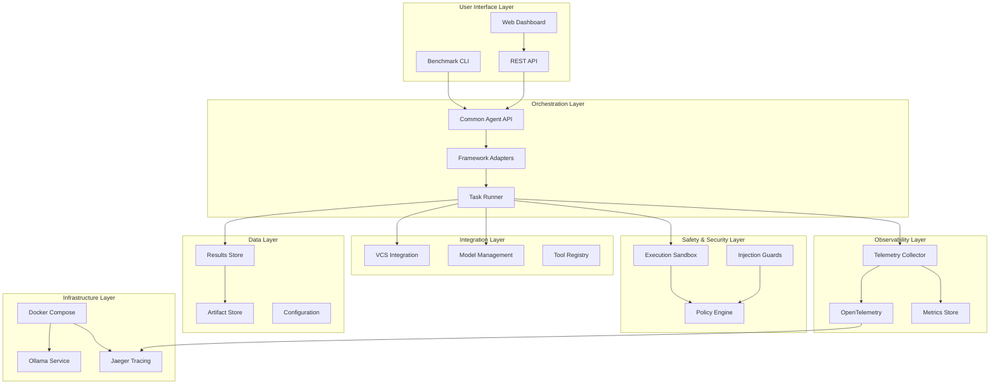

# AI Dev Squad Comparison Enhancement - Design Document

## Overview

This design document outlines the technical architecture for transforming the AI Dev Squad Comparison project into a comprehensive, enterprise-grade platform for evaluating AI agent orchestration frameworks. The design addresses the 10 major requirement areas through a modular, extensible architecture that prioritizes safety, observability, and reproducibility.

The enhanced system will support 11 orchestrator frameworks (7 existing + 4 new) with standardized interfaces, comprehensive safety controls, advanced benchmarking capabilities, and full observability. The architecture follows microservices principles with clear separation of concerns and extensive use of industry-standard tools and practices.

## Architecture

### High-Level System Architecture



### Core Components Architecture

#### 1. Common Agent API Layer

The foundation of the system providing standardized interfaces across all orchestrator frameworks.

**Key Components:**
- `AgentAdapter` Protocol: Defines the contract all orchestrators must implement
- `TaskSchema` Validator: Ensures consistent task input format
- `RunResult` Processor: Standardizes output format and metadata
- `EventStream` Manager: Handles real-time event emission

**Design Patterns:**
- Protocol-based interfaces for type safety
- Factory pattern for adapter instantiation  
- Observer pattern for event handling
- Strategy pattern for different execution modes

#### 2. Safety and Security Architecture

Multi-layered security approach with defense in depth principles.

**Execution Sandbox:**
```python
class ExecutionSandbox:
    def __init__(self, policy: SecurityPolicy):
        self.container_runtime = DockerRuntime()
        self.resource_limits = ResourceLimits()
        self.network_policy = NetworkPolicy()
        self.filesystem_policy = FilesystemPolicy()
    
    def execute_code(self, code: str, context: ExecutionContext) -> ExecutionResult:
        # Multi-layer validation and execution
        pass
```

**Security Layers:**
1. **Input Validation**: Prompt injection detection and sanitization
2. **Execution Isolation**: Docker containers with resource limits
3. **Network Controls**: Default-deny with explicit allowlists
4. **Filesystem Controls**: Chroot-style isolation with path validation
5. **Output Filtering**: LLM-based content analysis for harmful outputs
6. **Policy Enforcement**: YAML-based configurable security policies

#### 3. VCS Integration Architecture

Professional-grade version control integration supporting GitHub and GitLab.

**VCS Provider Architecture:**
```python
class VCSProvider(Protocol):
    def create_branch(self, name: str) -> Branch
    def commit_changes(self, files: List[str], message: str) -> Commit
    def create_pull_request(self, branch: str, title: str, description: str) -> PullRequest
    def handle_rate_limit(self, response: HTTPResponse) -> RetryStrategy
```

**Features:**
- Unified API across GitHub and GitLab
- Exponential backoff with jitter for rate limiting
- Automatic commit message generation using local models
- Branch-based workflow with PR/MR templates
- Minimal-scope token management
- Comprehensive error handling and retry logic

#### 4. Orchestrator Framework Integration

Standardized integration approach for all 11 supported frameworks.

**Existing Frameworks (Enhanced):**
- LangGraph: Enhanced with structured error handling and parallel execution
- CrewAI: Upgraded to v2 with guardrails and event hooks
- AutoGen: Enhanced with persistent memory and function calling
- n8n: API-driven integration with visual workflow export
- Semantic Kernel: Unified Python/C# implementation with skill-based architecture
- Claude Code Subagents: Secure subagent configuration with tool restrictions

**New Framework Integrations:**

**Langroid Integration:**
```python
class LangroidAdapter(AgentAdapter):
    def __init__(self):
        self.agents = {
            'developer': ChatAgent(system_prompt=DEVELOPER_PROMPT),
            'reviewer': ChatAgent(system_prompt=REVIEWER_PROMPT),
            'tester': ChatAgent(system_prompt=TESTER_PROMPT)
        }
        self.task_orchestrator = Task()
    
    def run_task(self, task: dict, context: dict) -> RunResult:
        # Implement conversation-style multi-agent workflow
        pass
```

**LlamaIndex Agents Integration:**
```python
class LlamaIndexAdapter(AgentAdapter):
    def __init__(self):
        self.index_builder = RepositoryIndexer()
        self.agent_workflow = AgentWorkflow()
        self.retrieval_engine = RetrievalEngine()
    
    def run_task(self, task: dict, context: dict) -> RunResult:
        # Implement retrieval-augmented agent workflow
        pass
```

**Haystack Agents Integration:**
```python
class HaystackAdapter(AgentAdapter):
    def __init__(self):
        self.agent = Agent()
        self.tools = [SearchTool(), CodeAnalysisTool(), TestRunnerTool()]
        self.pipeline = Pipeline()
    
    def run_task(self, task: dict, context: dict) -> RunResult:
        # Implement ReAct-style tool usage workflow
        pass
```

**Strands Agents Integration:**
```python
class StrandsAdapter(AgentAdapter):
    def __init__(self):
        self.agent_manager = StrandsAgentManager()
        self.telemetry = StrandsTelemetry()
        self.multi_cloud = MultiCloudProvider()
    
    def run_task(self, task: dict, context: dict) -> RunResult:
        # Implement enterprise-grade workflow with built-in observability
        pass
```

#### 5. Advanced Benchmarking System

Comprehensive evaluation framework with multiple quality dimensions.

**Benchmark Task Categories:**

1. **Single-file Bug Fix**
   - Input: Minimal repo with failing test and issue description
   - Expected: 1-2 line fix with passing tests
   - Verification: pytest execution, lint checks, PR creation

2. **Multi-step Feature Addition**
   - Input: Feature specification with code scaffold
   - Expected: New function with documentation and tests
   - Verification: Unit tests, docstring validation, integration checks

3. **Question Answering (Codebase/Logs)**
   - Input: Indexed codebase or log files with questions
   - Expected: Accurate answers with source references
   - Verification: Reference matching, semantic similarity scoring

4. **Code Optimization**
   - Input: Slow function with performance test
   - Expected: Faster implementation maintaining correctness
   - Verification: Performance threshold validation, correctness tests

5. **Edge Case - Incorrect Issue**
   - Input: Misleading or invalid issue description
   - Expected: No changes with explanatory comment
   - Verification: No file modifications, appropriate response

**Evaluation Dimensions:**
- **Functional Correctness**: Automated test execution and verification
- **Code Quality**: Static analysis, complexity metrics, style compliance
- **Performance**: Execution time, memory usage, token efficiency
- **Maintainability**: Documentation quality, code structure, readability
- **Reliability**: Self-consistency across multiple runs, error handling

**Self-Consistency Implementation:**
```python
class SelfConsistencyEvaluator:
    def evaluate(self, adapter: AgentAdapter, task: dict, runs: int = 5) -> ConsistencyResult:
        results = []
        for i in range(runs):
            result = adapter.run_task(task, {'seed': i})
            results.append(result)
        
        return self.analyze_consistency(results)
    
    def analyze_consistency(self, results: List[RunResult]) -> ConsistencyResult:
        # Implement majority voting and variance analysis
        pass
```

#### 6. Observability and Telemetry System

Enterprise-grade observability with OpenTelemetry integration.

**Telemetry Architecture:**
```python
class TelemetryCollector:
    def __init__(self):
        self.tracer = trace.get_tracer(__name__)
        self.logger = StructuredLogger()
        self.metrics = MetricsCollector()
    
    @contextmanager
    def trace_operation(self, operation_name: str, **attributes):
        with self.tracer.start_as_current_span(operation_name) as span:
            for key, value in attributes.items():
                span.set_attribute(key, value)
            yield span
```

**Event Schema:**
```json
{
  "timestamp": "2025-01-20T10:30:00Z",
  "event_type": "llm_call",
  "framework": "crewai_v2",
  "agent_id": "developer_agent",
  "task_id": "task_001",
  "trace_id": "abc123",
  "span_id": "def456",
  "data": {
    "model": "codellama:13b",
    "prompt_tokens": 150,
    "completion_tokens": 300,
    "latency_ms": 2500,
    "cost_usd": 0.0045
  }
}
```

**Observability Features:**
- Structured JSON logging with consistent schema
- OpenTelemetry spans for distributed tracing
- Real-time metrics collection and aggregation
- Cost tracking for both API and local model usage
- Performance profiling and bottleneck identification
- Dashboard with drill-down capabilities

#### 7. Ollama-First Performance Optimization

Comprehensive optimization for local model execution.

**Model Management:**
```python
class OllamaOptimizer:
    def __init__(self):
        self.model_router = ModelRouter()
        self.cache_manager = CacheManager()
        self.stream_handler = StreamHandler()
        self.context_manager = ContextManager()
    
    def optimize_for_task(self, task_type: str) -> ModelConfig:
        # Route to appropriate model based on task characteristics
        pass
    
    def handle_streaming(self, model_call: ModelCall) -> StreamingResponse:
        # Implement streaming with proper error handling
        pass
```

**Optimization Strategies:**
- Task-specific model routing (code models for coding, small models for simple tasks)
- Intelligent caching with prompt similarity detection
- Streaming response handling for improved UX
- Context window management with smart truncation
- Fallback strategies for resource-constrained environments
- Memory management for concurrent model usage

#### 8. Reproducibility and Packaging

Complete containerization and dependency management.

**Docker Compose Architecture:**
```yaml
version: '3.8'
services:
  benchmark-runner:
    build: .
    volumes:
      - ./:/workspace
      - results:/results
    environment:
      - OLLAMA_BASE_URL=http://ollama:11434
    depends_on:
      - ollama
      - jaeger
  
  ollama:
    image: ollama/ollama:latest
    ports:
      - "11434:11434"
    volumes:
      - ollama-models:/root/.ollama
  
  jaeger:
    image: jaegertracing/all-in-one:latest
    ports:
      - "16686:16686"
      - "14268:14268"
  
  dashboard:
    build: ./dashboard
    ports:
      - "8050:8050"
    depends_on:
      - benchmark-runner
```

**Reproducibility Features:**
- Pinned dependency versions with comprehensive lockfiles
- Environment capture including hardware specifications
- Seedable random number generation where possible
- Configuration version control and validation
- Automated environment setup and validation scripts

## Components and Interfaces

### Core Interfaces

#### AgentAdapter Protocol
```python
from typing import Protocol, Dict, Any, Iterable
from dataclasses import dataclass

@dataclass
class RunResult:
    status: str
    artifacts: Dict[str, Any]
    timings: Dict[str, float]
    tokens: Dict[str, int]
    costs: Dict[str, float]
    trace_id: str
    metadata: Dict[str, Any]

@dataclass
class Event:
    timestamp: str
    event_type: str
    framework: str
    agent_id: str
    task_id: str
    data: Dict[str, Any]

class AgentAdapter(Protocol):
    name: str
    
    def configure(self, config: Dict[str, Any]) -> None:
        """Configure the adapter with runtime parameters."""
        ...
    
    def run_task(self, task: Dict[str, Any], context: Dict[str, Any]) -> RunResult:
        """Execute a task and return standardized results."""
        ...
    
    def events(self) -> Iterable[Event]:
        """Stream events during task execution."""
        ...
```

#### Safety Interface
```python
class SafetyPolicy:
    def __init__(self, policy_file: str):
        self.filesystem_allowlist = []
        self.network_allowlist = []
        self.resource_limits = {}
        self.injection_patterns = []
    
    def validate_execution(self, code: str, context: dict) -> ValidationResult:
        """Validate code before execution."""
        pass
    
    def filter_output(self, output: str, context: dict) -> FilterResult:
        """Filter potentially harmful output."""
        pass
```

#### VCS Interface
```python
class VCSProvider(Protocol):
    def authenticate(self, credentials: Dict[str, str]) -> bool:
        """Authenticate with the VCS provider."""
        ...
    
    def create_branch(self, repo: str, branch_name: str) -> Branch:
        """Create a new branch."""
        ...
    
    def commit_changes(self, repo: str, branch: str, files: List[str], message: str) -> Commit:
        """Commit changes to a branch."""
        ...
    
    def create_pull_request(self, repo: str, source: str, target: str, title: str, description: str) -> PullRequest:
        """Create a pull request or merge request."""
        ...
```

## Data Models

### Task Schema
```python
@dataclass
class Task:
    id: str
    type: str  # One of: bugfix, feature_add, qa, optimize, edge_case
    inputs: Dict[str, Any]
    repo_path: str
    vcs_provider: str  # github or gitlab
    mode: str  # autonomous or advisory
    seed: Optional[int]
    model_prefs: Dict[str, str]
    timeout_seconds: int
    resource_limits: Dict[str, Any]
```

### Configuration Schema
```python
@dataclass
class SystemConfig:
    orchestrators: Dict[str, OrchestratorConfig]
    safety: SafetyConfig
    vcs: VCSConfig
    observability: ObservabilityConfig
    ollama: OllamaConfig
    benchmarks: BenchmarkConfig
```

## Error Handling

### Error Categories
1. **Configuration Errors**: Invalid settings, missing credentials
2. **Safety Violations**: Blocked operations, policy violations
3. **Integration Errors**: VCS failures, model unavailability
4. **Execution Errors**: Task failures, timeout exceeded
5. **System Errors**: Resource exhaustion, service unavailability

### Error Handling Strategy
- Structured error responses with error codes and context
- Automatic retry with exponential backoff for transient failures
- Graceful degradation for non-critical failures
- Comprehensive error logging with correlation IDs
- User-friendly error messages with suggested remediation

## Testing Strategy

### Test Categories

#### Unit Tests
- AgentAdapter implementation conformance
- Safety policy validation and enforcement
- VCS integration with mocked APIs
- Telemetry event generation and formatting
- Configuration validation and parsing

#### Integration Tests
- End-to-end task execution with real orchestrators
- VCS workflow testing with sandbox repositories
- Safety sandbox with actual code execution
- Observability pipeline with real telemetry data
- Docker Compose environment validation

#### Performance Tests
- Benchmark execution time and resource usage
- Concurrent orchestrator execution
- Memory usage under load
- Token usage optimization validation
- Cache effectiveness measurement

#### Security Tests
- Prompt injection attack simulation
- Sandbox escape attempt testing
- Network isolation validation
- File system access control verification
- Credential security and rotation testing

### Test Infrastructure
- Automated test execution in CI/CD pipeline
- Test data management with fixtures and factories
- Mock services for external dependencies
- Performance regression detection
- Security vulnerability scanning

This comprehensive design provides the foundation for transforming the AI Dev Squad Comparison project into a robust, enterprise-grade platform for evaluating AI agent orchestration frameworks with industry-standard practices for safety, observability, and reproducibility.