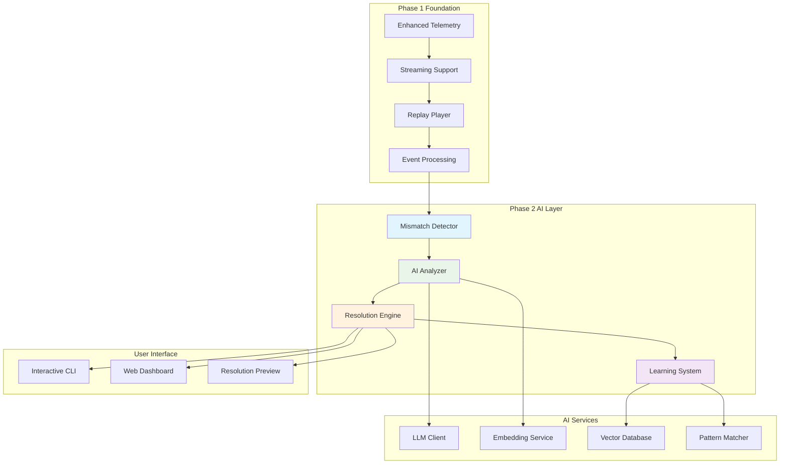

# Phase 2: AI-Powered Mismatch Resolution - Technical Design

## Architecture Overview

Phase 2 extends the Phase 1 Enhanced Telemetry Integration with intelligent mismatch analysis and resolution capabilities. The system uses AI to understand, classify, and resolve replay mismatches automatically or with minimal human intervention.



## Core Components

### 1. Mismatch Detection and Analysis Engine

The central component that detects, analyzes, and classifies replay mismatches using AI-powered techniques.

#### Architecture

```python
from dataclasses import dataclass
from enum import Enum
from typing import Dict, List, Optional, Any
from datetime import datetime
import asyncio

class MismatchType(Enum):
    WHITESPACE = "whitespace"
    JSON_ORDERING = "json_ordering"
    MARKDOWN_FORMATTING = "markdown_formatting"
    SEMANTICS_TEXT = "semantics_text"
    SEMANTICS_CODE = "semantics_code"
    NONDETERMINISM = "nondeterminism"
    POLICY_VIOLATION = "policy_violation"
    ENV_DRIFT = "env_drift"

class MismatchStatus(Enum):
    DETECTED = "detected"
    ANALYZING = "analyzing"
    RESOLVED = "resolved"
    FAILED = "failed"
    SKIPPED = "skipped"
    ERROR = "error"
    INCONCLUSIVE = "inconclusive"

@dataclass
class Mismatch:
    """Core mismatch entity following the requirements data model."""
    id: str
    run_id: str
    artifact_ids: List[str]
    mismatch_type: MismatchType
    detectors: List[str]
    evidence: Dict[str, Any]  # Contains diff_id and eval_ids
    status: MismatchStatus
    confidence_score: float
    created_at: datetime
    updated_at: datetime
    error_code: Optional[str] = None
    error_message: Optional[str] = None

class MismatchAnalyzer:
    """AI-powered mismatch analysis engine."""
    
    def __init__(self, ai_client, config_manager, telemetry_logger):
        self.ai_client = ai_client
        self.config = config_manager
        self.telemetry = telemetry_logger
        self.detectors = self._initialize_detectors()
        self.classifiers = self._initialize_classifiers()
    
    async def analyze_mismatch(self, expected: Any, actual: Any, 
                             context: Dict[str, Any]) -> Mismatch:
        """Analyze a mismatch and return structured analysis."""
        
        # Generate unique mismatch ID
        mismatch_id = self._generate_mismatch_id(expected, actual, context)
        
        # Emit telemetry event for analysis start
        await self.telemetry.emit_event({
            "type": "mismatch_analysis_started",
            "mismatch_id": mismatch_id,
            "run_id": context.get("run_id"),
            "timestamp": datetime.utcnow().isoformat()
        })
        
        try:
            # Multi-stage analysis pipeline
            detection_result = await self._detect_mismatch_type(expected, actual)
            classification = await self._classify_mismatch(detection_result, context)
            evidence = await self._gather_evidence(expected, actual, classification)
            
            mismatch = Mismatch(
                id=mismatch_id,
                run_id=context.get("run_id", "unknown"),
                artifact_ids=context.get("artifact_ids", []),
                mismatch_type=classification.primary_type,
                detectors=detection_result.detector_names,
                evidence=evidence,
                status=MismatchStatus.ANALYZING,
                confidence_score=classification.confidence,
                created_at=datetime.utcnow(),
                updated_at=datetime.utcnow()
            )
            
            # Emit analysis completion event
            await self.telemetry.emit_event({
                "type": "mismatch_analysis_completed",
                "mismatch_id": mismatch_id,
                "mismatch_type": classification.primary_type.value,
                "confidence_score": classification.confidence,
                "duration_ms": (datetime.utcnow() - mismatch.created_at).total_seconds() * 1000
            })
            
            return mismatch
            
        except Exception as e:
            # Emit error event
            await self.telemetry.emit_event({
                "type": "mismatch_analysis_error",
                "mismatch_id": mismatch_id,
                "error": str(e),
                "timestamp": datetime.utcnow().isoformat()
            })
            
            return Mismatch(
                id=mismatch_id,
                run_id=context.get("run_id", "unknown"),
                artifact_ids=context.get("artifact_ids", []),
                mismatch_type=MismatchType.ENV_DRIFT,  # Default fallback
                detectors=["error_detector"],
                evidence={"error": str(e)},
                status=MismatchStatus.ERROR,
                confidence_score=0.0,
                created_at=datetime.utcnow(),
                updated_at=datetime.utcnow(),
                error_code="ANALYSIS_FAILED",
                error_message=str(e)
            )
    
    def _initialize_detectors(self):
        """Initialize mismatch detection components."""
        return {
            "whitespace": WhitespaceDetector(),
            "json_structure": JsonStructureDetector(),
            "semantic_text": SemanticTextDetector(self.ai_client),
            "semantic_code": SemanticCodeDetector(self.ai_client),
            "temporal": TemporalDetector(),
            "environmental": EnvironmentalDetector()
        }
    
    def _initialize_classifiers(self):
        """Initialize AI-powered classifiers."""
        return {
            "primary": PrimaryMismatchClassifier(self.ai_client),
            "semantic": SemanticEquivalenceClassifier(self.ai_client),
            "confidence": ConfidenceScorer(self.ai_client)
        }
```

### 2. AI-Powered Resolution Engine

Generates and applies resolution strategies based on mismatch analysis.

#### Architecture

```python
from enum import Enum
from typing import List, Dict, Any, Optional
from dataclasses import dataclass

class ResolutionActionType(Enum):
    REPLACE_ARTIFACT = "replace_artifact"
    UPDATE_METADATA = "update_metadata"
    APPLY_TRANSFORM = "apply_transform"
    IGNORE_MISMATCH = "ignore_mismatch"

class SafetyLevel(Enum):
    EXPERIMENTAL = "experimental"  # Requires explicit approval
    ADVISORY = "advisory"          # Shows preview, asks for approval
    AUTOMATIC = "automatic"        # Applies automatically if confidence high

@dataclass
class ResolutionAction:
    """Individual resolution action following requirements data model."""
    type: ResolutionActionType
    target_artifact_id: str
    transformation: str
    parameters: Dict[str, Any]
    reversible: bool

@dataclass
class ResolutionPlan:
    """Complete resolution plan following requirements data model."""
    id: str
    mismatch_id: str
    actions: List[ResolutionAction]
    safety_level: SafetyLevel
    approvals: List[Dict[str, Any]]  # Approval records
    outcome: Optional[Dict[str, Any]] = None
    created_at: datetime = None
    applied_at: Optional[datetime] = None

class ResolutionEngine:
    """AI-powered resolution strategy engine."""
    
    def __init__(self, ai_client, safety_manager, rollback_manager, telemetry_logger):
        self.ai_client = ai_client
        self.safety = safety_manager
        self.rollback = rollback_manager
        self.telemetry = telemetry_logger
        self.strategies = self._initialize_strategies()
        self.validators = self._initialize_validators()
    
    async def generate_resolution_plan(self, mismatch: Mismatch) -> ResolutionPlan:
        """Generate a resolution plan for the given mismatch."""
        
        plan_id = f"plan_{mismatch.id}_{int(datetime.utcnow().timestamp())}"
        
        # Emit telemetry for plan generation start
        await self.telemetry.emit_event({
            "type": "resolution_plan_generation_started",
            "plan_id": plan_id,
            "mismatch_id": mismatch.id,
            "mismatch_type": mismatch.mismatch_type.value
        })
        
        try:
            # Select appropriate strategy based on mismatch type
            strategy = self._select_strategy(mismatch)
            
            # Generate resolution actions using AI
            actions = await strategy.generate_actions(mismatch)
            
            # Determine safety level based on confidence and risk
            safety_level = self._determine_safety_level(mismatch, actions)
            
            plan = ResolutionPlan(
                id=plan_id,
                mismatch_id=mismatch.id,
                actions=actions,
                safety_level=safety_level,
                approvals=[],
                created_at=datetime.utcnow()
            )
            
            # Emit plan generation completion
            await self.telemetry.emit_event({
                "type": "resolution_plan_generated",
                "plan_id": plan_id,
                "actions_count": len(actions),
                "safety_level": safety_level.value,
                "confidence_score": mismatch.confidence_score
            })
            
            return plan
            
        except Exception as e:
            await self.telemetry.emit_event({
                "type": "resolution_plan_generation_error",
                "plan_id": plan_id,
                "error": str(e)
            })
            raise
    
    async def apply_resolution_plan(self, plan: ResolutionPlan) -> Dict[str, Any]:
        """Apply a resolution plan with safety checks and rollback capability."""
        
        # Create rollback checkpoint
        checkpoint_id = await self.rollback.create_checkpoint(plan.mismatch_id)
        
        # Emit application start event
        await self.telemetry.emit_event({
            "type": "resolution_plan_application_started",
            "plan_id": plan.id,
            "checkpoint_id": checkpoint_id,
            "safety_level": plan.safety_level.value
        })
        
        try:
            # Pre-application validation
            validation_result = await self._validate_plan(plan)
            if not validation_result.is_safe:
                raise ValueError(f"Plan validation failed: {validation_result.reason}")
            
            # Apply actions sequentially with validation
            applied_actions = []
            for action in plan.actions:
                action_result = await self._apply_action(action)
                applied_actions.append(action_result)
                
                # Validate after each action
                if not action_result.success:
                    await self.rollback.rollback_to_checkpoint(checkpoint_id)
                    raise ValueError(f"Action failed: {action_result.error}")
            
            # Post-application validation
            final_validation = await self._validate_resolution_outcome(plan, applied_actions)
            
            outcome = {
                "status": "applied",
                "artifacts": [result.artifact_id for result in applied_actions],
                "logs": [result.log for result in applied_actions],
                "validation": final_validation
            }
            
            # Update plan with outcome
            plan.outcome = outcome
            plan.applied_at = datetime.utcnow()
            
            # Emit success event
            await self.telemetry.emit_event({
                "type": "resolution_plan_applied_successfully",
                "plan_id": plan.id,
                "actions_applied": len(applied_actions),
                "duration_ms": (plan.applied_at - plan.created_at).total_seconds() * 1000
            })
            
            return outcome
            
        except Exception as e:
            # Rollback on failure
            await self.rollback.rollback_to_checkpoint(checkpoint_id)
            
            outcome = {
                "status": "failed",
                "error": str(e),
                "rollback_applied": True
            }
            
            plan.outcome = outcome
            
            # Emit failure event
            await self.telemetry.emit_event({
                "type": "resolution_plan_application_failed",
                "plan_id": plan.id,
                "error": str(e),
                "rollback_applied": True
            })
            
            return outcome
    
    def _initialize_strategies(self):
        """Initialize resolution strategies for different mismatch types."""
        return {
            MismatchType.WHITESPACE: WhitespaceResolutionStrategy(),
            MismatchType.JSON_ORDERING: JsonOrderingResolutionStrategy(),
            MismatchType.MARKDOWN_FORMATTING: MarkdownFormattingStrategy(),
            MismatchType.SEMANTICS_TEXT: SemanticTextResolutionStrategy(self.ai_client),
            MismatchType.SEMANTICS_CODE: SemanticCodeResolutionStrategy(self.ai_client),
            MismatchType.NONDETERMINISM: NondeterminismResolutionStrategy(),
            MismatchType.POLICY_VIOLATION: PolicyViolationStrategy(self.safety),
            MismatchType.ENV_DRIFT: EnvironmentalDriftStrategy()
        }
```

### 3. Semantic Equivalence Detection

Advanced AI-powered system for detecting semantic equivalence between different representations.

#### Architecture

```python
class SemanticEquivalenceDetector:
    """AI-powered semantic equivalence detection system."""
    
    def __init__(self, ai_client, embedding_service, config_manager):
        self.ai_client = ai_client
        self.embeddings = embedding_service
        self.config = config_manager
        self.equivalence_criteria = self._load_equivalence_criteria()
    
    async def detect_equivalence(self, expected: Any, actual: Any, 
                               artifact_type: str) -> Dict[str, Any]:
        """Detect semantic equivalence between expected and actual values."""
        
        # Select appropriate equivalence criteria
        criteria = self.equivalence_criteria.get(artifact_type, [])
        
        results = {}
        for criterion in criteria:
            if not criterion.enabled:
                continue
                
            try:
                result = await self._apply_criterion(expected, actual, criterion)
                results[criterion.method.value] = result
            except Exception as e:
                results[criterion.method.value] = {
                    "error": str(e),
                    "equivalent": False,
                    "confidence": 0.0
                }
        
        # Aggregate results
        overall_result = self._aggregate_equivalence_results(results)
        
        return {
            "equivalent": overall_result.equivalent,
            "confidence": overall_result.confidence,
            "method_results": results,
            "explanation": overall_result.explanation
        }
    
    async def _apply_criterion(self, expected: Any, actual: Any, 
                             criterion) -> Dict[str, Any]:
        """Apply a specific equivalence criterion."""
        
        if criterion.method == "exact":
            return self._exact_match(expected, actual)
        elif criterion.method == "semantic_similarity":
            return await self._semantic_similarity(expected, actual, criterion.parameters)
        elif criterion.method == "ast_normalized":
            return self._ast_normalized_match(expected, actual)
        elif criterion.method == "canonical_json":
            return self._canonical_json_match(expected, actual)
        elif criterion.method == "test_execution":
            return await self._test_execution_equivalence(expected, actual, criterion.parameters)
        else:
            raise ValueError(f"Unknown equivalence method: {criterion.method}")
    
    async def _semantic_similarity(self, expected: Any, actual: Any, 
                                 parameters: Dict[str, Any]) -> Dict[str, Any]:
        """Use AI to determine semantic similarity."""
        
        # Convert to text representations
        expected_text = self._to_text(expected)
        actual_text = self._to_text(actual)
        
        # Generate embeddings
        expected_embedding = await self.embeddings.embed(expected_text)
        actual_embedding = await self.embeddings.embed(actual_text)
        
        # Calculate cosine similarity
        similarity_score = self._cosine_similarity(expected_embedding, actual_embedding)
        
        # Use LLM for detailed analysis if similarity is borderline
        threshold = parameters.get("threshold", 0.8)
        if 0.6 <= similarity_score <= 0.9:
            llm_analysis = await self.ai_client.analyze_semantic_equivalence(
                expected_text, actual_text, similarity_score
            )
            
            return {
                "equivalent": llm_analysis.equivalent,
                "confidence": llm_analysis.confidence,
                "similarity_score": similarity_score,
                "explanation": llm_analysis.explanation,
                "method": "semantic_similarity_with_llm"
            }
        else:
            equivalent = similarity_score >= threshold
            return {
                "equivalent": equivalent,
                "confidence": min(similarity_score, 1.0 - similarity_score) + 0.5,
                "similarity_score": similarity_score,
                "explanation": f"Embedding similarity: {similarity_score:.3f}",
                "method": "semantic_similarity_embedding"
            }
```

### 4. Learning and Adaptation System

Machine learning system that learns from resolution patterns and improves over time.

#### Architecture

```python
class LearningSystem:
    """AI-powered learning and adaptation system."""
    
    def __init__(self, vector_db, pattern_matcher, ai_client, telemetry_logger):
        self.vector_db = vector_db
        self.pattern_matcher = pattern_matcher
        self.ai_client = ai_client
        self.telemetry = telemetry_logger
        self.pattern_store = PatternStore(vector_db)
        self.learning_engine = LearningEngine(ai_client)
    
    async def learn_from_resolution(self, mismatch: Mismatch, 
                                  resolution_plan: ResolutionPlan,
                                  outcome: Dict[str, Any]):
        """Learn from a completed resolution."""
        
        # Create learning pattern
        pattern = await self._create_learning_pattern(mismatch, resolution_plan, outcome)
        
        # Store pattern in vector database
        await self.pattern_store.store_pattern(pattern)
        
        # Update learning models
        await self.learning_engine.update_models(pattern)
        
        # Emit learning event
        await self.telemetry.emit_event({
            "type": "learning_pattern_stored",
            "pattern_id": pattern.id,
            "mismatch_type": mismatch.mismatch_type.value,
            "resolution_success": outcome.get("status") == "applied",
            "confidence_improvement": pattern.confidence_delta
        })
    
    async def find_similar_patterns(self, mismatch: Mismatch) -> List[Dict[str, Any]]:
        """Find similar historical patterns for a mismatch."""
        
        # Create query embedding from mismatch
        query_embedding = await self._create_mismatch_embedding(mismatch)
        
        # Search vector database
        similar_patterns = await self.vector_db.similarity_search(
            query_embedding, 
            top_k=10, 
            threshold=0.7
        )
        
        # Rank and filter patterns
        ranked_patterns = await self._rank_patterns(mismatch, similar_patterns)
        
        return ranked_patterns
    
    async def suggest_resolution_improvements(self, mismatch: Mismatch,
                                           current_plan: ResolutionPlan) -> List[Dict[str, Any]]:
        """Suggest improvements to a resolution plan based on learned patterns."""
        
        similar_patterns = await self.find_similar_patterns(mismatch)
        
        improvements = []
        for pattern in similar_patterns:
            if pattern.success_rate > 0.8:  # Only suggest from successful patterns
                improvement = await self._generate_improvement_suggestion(
                    current_plan, pattern
                )
                if improvement:
                    improvements.append(improvement)
        
        return improvements
```

### 5. Interactive Resolution Interface

User interface components for manual review and resolution of mismatches.

#### Architecture

```python
class InteractiveResolutionInterface:
    """Interactive interface for mismatch resolution."""
    
    def __init__(self, resolution_engine, learning_system, telemetry_logger):
        self.resolution_engine = resolution_engine
        self.learning_system = learning_system
        self.telemetry = telemetry_logger
        self.cli_interface = CLIInterface()
        self.web_interface = WebInterface()
    
    async def start_interactive_resolution(self, mismatch: Mismatch) -> Dict[str, Any]:
        """Start interactive resolution process."""
        
        # Generate initial resolution plan
        plan = await self.resolution_engine.generate_resolution_plan(mismatch)
        
        # Find similar patterns for context
        similar_patterns = await self.learning_system.find_similar_patterns(mismatch)
        
        # Present to user
        user_choice = await self._present_resolution_options(
            mismatch, plan, similar_patterns
        )
        
        if user_choice.action == "approve":
            return await self.resolution_engine.apply_resolution_plan(plan)
        elif user_choice.action == "modify":
            modified_plan = await self._handle_plan_modification(plan, user_choice.modifications)
            return await self.resolution_engine.apply_resolution_plan(modified_plan)
        elif user_choice.action == "reject":
            await self._handle_plan_rejection(plan, user_choice.reason)
            return {"status": "rejected", "reason": user_choice.reason}
        else:
            return {"status": "cancelled"}
    
    async def _present_resolution_options(self, mismatch: Mismatch, 
                                        plan: ResolutionPlan,
                                        similar_patterns: List[Dict[str, Any]]):
        """Present resolution options to user."""
        
        # Format presentation data
        presentation = {
            "mismatch": {
                "id": mismatch.id,
                "type": mismatch.mismatch_type.value,
                "confidence": mismatch.confidence_score,
                "evidence": mismatch.evidence
            },
            "resolution_plan": {
                "id": plan.id,
                "actions": [self._format_action(action) for action in plan.actions],
                "safety_level": plan.safety_level.value
            },
            "similar_patterns": similar_patterns[:5],  # Top 5 most similar
            "options": ["approve", "modify", "reject", "cancel"]
        }
        
        # Use appropriate interface based on configuration
        if self._should_use_web_interface():
            return await self.web_interface.present_resolution(presentation)
        else:
            return await self.cli_interface.present_resolution(presentation)
```

## Integration with Phase 1 Components

### Enhanced Telemetry Integration

Phase 2 extends the Phase 1 telemetry schema with AI-specific events:

```python
# Extension to common/telemetry/schema.py
AI_MISMATCH_EVENTS = {
    "mismatch_analysis_started": {
        "mismatch_id": "string",
        "run_id": "string", 
        "timestamp": "datetime"
    },
    "mismatch_analysis_completed": {
        "mismatch_id": "string",
        "mismatch_type": "string",
        "confidence_score": "float",
        "duration_ms": "integer"
    },
    "resolution_plan_generated": {
        "plan_id": "string",
        "mismatch_id": "string",
        "actions_count": "integer",
        "safety_level": "string",
        "confidence_score": "float"
    },
    "resolution_plan_applied_successfully": {
        "plan_id": "string",
        "actions_applied": "integer",
        "duration_ms": "integer"
    },
    "semantic_equivalence_detected": {
        "mismatch_id": "string",
        "method": "string",
        "confidence": "float",
        "similarity_score": "float"
    },
    "learning_pattern_stored": {
        "pattern_id": "string",
        "mismatch_type": "string",
        "resolution_success": "boolean",
        "confidence_improvement": "float"
    }
}
```

### Enhanced Replay Player Integration

The replay player is extended to support AI-powered mismatch resolution:

```python
# Extension to benchmark/replay/player.py
class AIEnhancedReplayPlayer(ReplayPlayer):
    """Replay player with AI-powered mismatch resolution."""
    
    def __init__(self, *args, **kwargs):
        super().__init__(*args, **kwargs)
        self.mismatch_analyzer = MismatchAnalyzer(
            ai_client=self.config.ai_client,
            config_manager=self.config,
            telemetry_logger=self.telemetry
        )
        self.resolution_engine = ResolutionEngine(
            ai_client=self.config.ai_client,
            safety_manager=self.safety,
            rollback_manager=self.rollback,
            telemetry_logger=self.telemetry
        )
        self.learning_system = LearningSystem(
            vector_db=self.config.vector_db,
            pattern_matcher=self.config.pattern_matcher,
            ai_client=self.config.ai_client,
            telemetry_logger=self.telemetry
        )
    
    async def handle_mismatch(self, expected: Any, actual: Any, 
                            context: Dict[str, Any]) -> Dict[str, Any]:
        """Handle mismatch with AI-powered analysis and resolution."""
        
        # Analyze mismatch
        mismatch = await self.mismatch_analyzer.analyze_mismatch(expected, actual, context)
        
        # Check if auto-resolution is appropriate
        if self._should_auto_resolve(mismatch):
            plan = await self.resolution_engine.generate_resolution_plan(mismatch)
            outcome = await self.resolution_engine.apply_resolution_plan(plan)
            
            # Learn from the resolution
            await self.learning_system.learn_from_resolution(mismatch, plan, outcome)
            
            return outcome
        else:
            # Fall back to interactive resolution or traditional handling
            if self.config.interactive_mode:
                interface = InteractiveResolutionInterface(
                    self.resolution_engine, 
                    self.learning_system, 
                    self.telemetry
                )
                return await interface.start_interactive_resolution(mismatch)
            else:
                # Traditional mismatch handling
                return await super().handle_mismatch(expected, actual, context)
```

## Data Storage and Management

### Vector Database Schema

For pattern storage and similarity search:

```sql
-- Vector database schema for pattern storage
CREATE TABLE mismatch_patterns (
    id UUID PRIMARY KEY,
    mismatch_type VARCHAR(50) NOT NULL,
    embedding VECTOR(1536), -- OpenAI embedding dimension
    pattern_data JSONB NOT NULL,
    success_rate FLOAT NOT NULL DEFAULT 0.0,
    usage_count INTEGER NOT NULL DEFAULT 0,
    created_at TIMESTAMP NOT NULL DEFAULT NOW(),
    updated_at TIMESTAMP NOT NULL DEFAULT NOW()
);

CREATE INDEX idx_mismatch_patterns_embedding ON mismatch_patterns 
USING ivfflat (embedding vector_cosine_ops);

CREATE INDEX idx_mismatch_patterns_type ON mismatch_patterns (mismatch_type);
```

### Equivalence Criteria Configuration

```yaml
# config/equivalence_criteria.yaml
equivalence_criteria:
  text:
    - id: "exact_match"
      method: "exact"
      enabled: true
      version: "1.0"
    
    - id: "semantic_similarity"
      method: "semantic_similarity"
      parameters:
        threshold: 0.85
        model: "text-embedding-ada-002"
        timeout_ms: 5000
      enabled: true
      version: "1.0"
  
  code:
    - id: "ast_normalized"
      method: "ast_normalized"
      enabled: true
      version: "1.0"
    
    - id: "semantic_code_similarity"
      method: "semantic_similarity"
      parameters:
        threshold: 0.90
        model: "code-davinci-002"
        timeout_ms: 10000
      enabled: true
      version: "1.0"
  
  json:
    - id: "canonical_json"
      method: "canonical_json"
      enabled: true
      version: "1.0"
    
    - id: "semantic_json"
      method: "semantic_similarity"
      parameters:
        threshold: 0.95
        model: "text-embedding-ada-002"
        timeout_ms: 3000
      enabled: false  # Disabled by default for JSON
      version: "1.0"
```

## Security and Privacy Considerations

### AI Service Integration Security

```python
class SecureAIClient:
    """Secure wrapper for AI service integration."""
    
    def __init__(self, config, redaction_manager):
        self.config = config
        self.redaction = redaction_manager
        self.client = self._initialize_client()
    
    async def analyze_semantic_equivalence(self, text1: str, text2: str, 
                                         similarity_score: float) -> Dict[str, Any]:
        """Securely analyze semantic equivalence with redaction."""
        
        # Apply redaction policies
        redacted_text1 = await self.redaction.redact_sensitive_data(text1)
        redacted_text2 = await self.redaction.redact_sensitive_data(text2)
        
        # Prepare secure prompt
        prompt = self._create_secure_prompt(redacted_text1, redacted_text2, similarity_score)
        
        # Call AI service with security headers
        response = await self.client.complete(
            prompt=prompt,
            headers=self._get_security_headers(),
            timeout=self.config.ai_timeout
        )
        
        # Validate and sanitize response
        return self._sanitize_ai_response(response)
    
    def _get_security_headers(self) -> Dict[str, str]:
        """Get security headers for AI service calls."""
        return {
            "User-Agent": f"ai-dev-squad/{self.config.version}",
            "X-Request-ID": self._generate_request_id(),
            "X-Privacy-Level": self.config.privacy_level
        }
```

## Performance Optimization

### Caching Strategy

```python
class AIAnalysisCache:
    """Caching layer for AI analysis results."""
    
    def __init__(self, redis_client, ttl_seconds=3600):
        self.redis = redis_client
        self.ttl = ttl_seconds
    
    async def get_cached_analysis(self, mismatch_signature: str) -> Optional[Dict[str, Any]]:
        """Get cached analysis result."""
        cache_key = f"ai_analysis:{mismatch_signature}"
        cached_result = await self.redis.get(cache_key)
        
        if cached_result:
            return json.loads(cached_result)
        return None
    
    async def cache_analysis(self, mismatch_signature: str, analysis: Dict[str, Any]):
        """Cache analysis result."""
        cache_key = f"ai_analysis:{mismatch_signature}"
        await self.redis.setex(
            cache_key, 
            self.ttl, 
            json.dumps(analysis, default=str)
        )
```

### Batch Processing

```python
class BatchMismatchProcessor:
    """Batch processor for multiple mismatches."""
    
    def __init__(self, analyzer, max_batch_size=10):
        self.analyzer = analyzer
        self.max_batch_size = max_batch_size
    
    async def process_batch(self, mismatches: List[Tuple[Any, Any, Dict[str, Any]]]) -> List[Mismatch]:
        """Process multiple mismatches in batch."""
        
        # Group by mismatch type for efficient processing
        grouped_mismatches = self._group_by_type(mismatches)
        
        results = []
        for mismatch_type, group in grouped_mismatches.items():
            # Process each group in parallel
            batch_results = await asyncio.gather(*[
                self.analyzer.analyze_mismatch(expected, actual, context)
                for expected, actual, context in group
            ])
            results.extend(batch_results)
        
        return results
```

## Testing Strategy

### Unit Tests

```python
# tests/test_ai_mismatch_resolution.py
import pytest
from unittest.mock import AsyncMock, MagicMock
from common.ai_mismatch_resolution import MismatchAnalyzer, ResolutionEngine

class TestMismatchAnalyzer:
    
    @pytest.fixture
    def analyzer(self):
        ai_client = AsyncMock()
        config_manager = MagicMock()
        telemetry_logger = AsyncMock()
        return MismatchAnalyzer(ai_client, config_manager, telemetry_logger)
    
    @pytest.mark.asyncio
    async def test_analyze_whitespace_mismatch(self, analyzer):
        """Test analysis of whitespace mismatch."""
        expected = "hello world"
        actual = "hello  world"  # Extra space
        context = {"run_id": "test_run", "artifact_ids": ["artifact_1"]}
        
        result = await analyzer.analyze_mismatch(expected, actual, context)
        
        assert result.mismatch_type == MismatchType.WHITESPACE
        assert result.confidence_score > 0.9
        assert result.status == MismatchStatus.ANALYZING
    
    @pytest.mark.asyncio
    async def test_analyze_semantic_text_mismatch(self, analyzer):
        """Test analysis of semantic text mismatch."""
        expected = "The quick brown fox jumps over the lazy dog"
        actual = "A fast brown fox leaps over the sleepy dog"
        context = {"run_id": "test_run", "artifact_ids": ["artifact_1"]}
        
        # Mock AI client response
        analyzer.ai_client.analyze_semantic_equivalence.return_value = {
            "equivalent": True,
            "confidence": 0.85,
            "explanation": "Semantically equivalent with different wording"
        }
        
        result = await analyzer.analyze_mismatch(expected, actual, context)
        
        assert result.mismatch_type == MismatchType.SEMANTICS_TEXT
        assert result.confidence_score > 0.8
```

### Integration Tests

```python
# tests/test_ai_integration.py
import pytest
from common.ai_mismatch_resolution import AIEnhancedReplayPlayer

class TestAIIntegration:
    
    @pytest.mark.asyncio
    async def test_end_to_end_mismatch_resolution(self):
        """Test complete mismatch resolution flow."""
        # Setup test data
        recording_data = self._create_test_recording()
        modified_data = self._create_modified_recording()
        
        # Create AI-enhanced player
        player = AIEnhancedReplayPlayer(config=self.test_config)
        
        # Replay with AI resolution
        result = await player.replay_with_ai_resolution(recording_data, modified_data)
        
        # Verify resolution was applied
        assert result.status == "success"
        assert result.mismatches_resolved > 0
        assert result.auto_resolution_rate > 0.7
```

## Deployment and Configuration

### Configuration Schema

```yaml
# config/ai_mismatch_resolution.yaml
ai_mismatch_resolution:
  enabled: true
  
  ai_services:
    primary_provider: "openai"
    fallback_provider: "local_llm"
    
    openai:
      api_key: "${OPENAI_API_KEY}"
      model: "gpt-4"
      embedding_model: "text-embedding-ada-002"
      max_tokens: 2000
      temperature: 0.1
    
    local_llm:
      endpoint: "http://localhost:11434"
      model: "llama3.1:8b"
      embedding_model: "nomic-embed-text"
  
  resolution_engine:
    auto_resolve_threshold: 0.9
    max_resolution_attempts: 3
    safety_level: "advisory"  # experimental, advisory, automatic
    
  learning_system:
    enabled: true
    pattern_retention_days: 90
    min_pattern_confidence: 0.7
    learning_rate: 0.01
  
  performance:
    cache_ttl_seconds: 3600
    max_concurrent_analyses: 10
    batch_size: 5
    timeout_seconds: 30
  
  security:
    redaction_enabled: true
    privacy_level: "standard"  # minimal, standard, strict
    audit_all_decisions: true
```

## Monitoring and Observability

### Metrics and Dashboards

Key metrics to track:

- **Mismatch Resolution Rate**: Percentage of mismatches successfully resolved
- **Auto-Resolution Accuracy**: Percentage of auto-resolutions that are correct
- **AI Analysis Latency**: Time taken for AI analysis of mismatches
- **Learning System Performance**: Pattern recognition accuracy over time
- **Cost Tracking**: AI service usage and costs
- **User Satisfaction**: Feedback on AI-suggested resolutions

### Alerting

Critical alerts:

- AI service availability issues
- High false-positive resolution rate
- Unusual mismatch patterns indicating system issues
- Performance degradation in analysis or resolution

## Migration and Rollout Strategy

### Phase 2 Rollout Plan

1. **Week 1-2**: Core mismatch analysis and classification engine
2. **Week 3-4**: Resolution engine and semantic equivalence detection
3. **Week 5**: Learning system and interactive interface
4. **Week 6**: Testing, documentation, and production deployment

### Backward Compatibility

Phase 2 maintains full backward compatibility with Phase 1:

- All existing APIs continue to work unchanged
- New AI features are opt-in via configuration
- Graceful degradation when AI services are unavailable
- Existing replay modes (strict/warn/hybrid) remain available

This design provides a comprehensive foundation for AI-powered mismatch resolution while maintaining the security, performance, and reliability standards established in Phase 1.