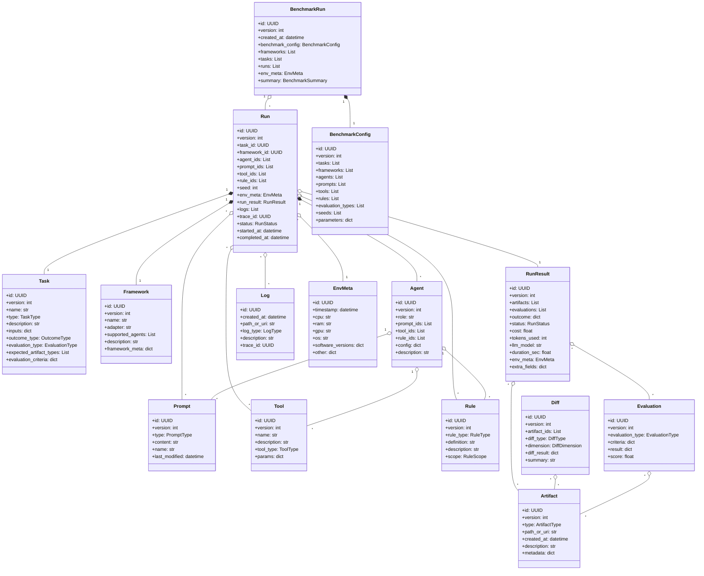

# v1 Data Model: AI Squad Benchmarking Tool

Created by: Brock Butler
Created time: September 25, 2025 10:14 PM
Category: Data Model Definition
Last edited by: Brock Butler
Last updated time: September 25, 2025 10:57 PM
Parent item: v1 (https://www.notion.so/v1-27a11cd755ab80efa99cfad4cd59780d?pvs=21)

# AI Squad Benchmarking Tool: Data Model

The data model is the beating heart of this product—it makes everything extensible, empowers fast “what if?” learning loops, and enables ironclad provenance behind every benchmark claim you make or share. Everything comes back to auditability, evolution, and trust—internally and when you go public.

## Why the Data Model Matters to Product Strategy

Our data model isn’t just a technical detail—it’s the backbone of the entire AI Dev Squad Enhancement Platform. 

Here’s why:

**1. It Powers True Comparison and Vendor Neutrality.**

Because every entity (Agent, Task, Framework, Run, Artifact, Evaluation, etc.) is versioned, typed, and traceable by reference, you can compare outputs across frameworks, LLMs, tooling setups, or even teams—fairly and reproducibly. This is what enables apples-to-apples scoring and removes “magic” from the process.

**2. It Makes the Platform Extensible and Adaptable.**

A modular data model means you can plug in new frameworks, task types, evaluation strategies, or agent configurations as the AI ecosystem evolves, instead of hard-coding logic for just a few static tools. You’re never boxed in by today’s technology or this month’s hot agent library.

**3. It Enables Robust Automation, Analytics, and UX.**

Enforced cross-references allow for deep reporting, dashboarding, “parity matrix” displays, drill-down diffing, and smart filtering—critical for both private engineering and any public data you share. The structured error and status model makes experiments both debuggable and trustworthy.

**4. It Drives Trust, Reproducibility, and Enterprise Readiness.**

Semantic versioning, explicit error handling, and full environment tracking mean that results can be replayed and verified anywhere—by your team, stakeholders, or the broader open-source community. No more “works on my machine” or “what happened here?” syndrome.

**5. It Is a Strategic Asset.**

Your data model becomes a “language” for describing and sharing AI orchestration results. This lowers the bar for new contributors, unlocks research collaborations, and can even serve as a foundation for an industry standard if you publish your schemas (perfect for open-source or future platform integrations).

**6. It Supports the “Product as R&D Engine” Vision.**

Every experiment, tweak, or new benchmark you run helps further validate and evolve the model. You get automatic audit trails for what worked, what failed, and why—fuel for continuous system improvement and knowledge sharing.

---

**Big Picture:**

A great data model is the difference between a “cool demo” and a foundational infrastructure platform. It unlocks extensibility, trust, and easy adoption for both you (internally) and your future ecosystem of public users, researchers, and enterprise teams evaluating multi-agent AI.

## Data Model ERD



[Untitled diagram _ Mermaid Chart-2025-09-26-014057.png](v1%20Data%20Model%20AI%20Squad%20Benchmarking%20Tool%2027a11cd755ab80919898e447a4650c1f/Untitled_diagram___Mermaid_Chart-2025-09-26-014057.png)

---

## Task

A Task defines a “unit of work” to be performed and evaluated across one or more frameworks, agents, and configurations. It specifies what should be done (e.g., bug fix, documentation creation, optimization), the expected inputs and outputs, the type and format of results to produce, and the method(s) for evaluation (tests, rubrics, diffs, etc). The Task serves as the ground truth for benchmarking—ensuring every run, regardless of framework or agent, is working toward the same explicit goal and can be compared fairly, reproducibly, and at scale. With versioning and strict typing, Tasks allow easy A/B testing, experiment tracking, and the addition of new automation scenarios over time.

### Fields & Definitions

- **id (UUID):** Unique identifier for the task. Used to reference this task in all configs/results.
- **version (str, e.g., “1.0.0”):** Semantic version number for the schema/behavior/inputs of this task. Increment on any breaking or material change. Use the familiar “major.minor.patch” scheme.
- **name (str):** Human-friendly name, e.g., “Generate Onboarding FAQ”
- **type (enum):** The structured category of work to be performed. This should be a controlled vocabulary (enum), not free text.
    
    Supported examples:
    
    - “generate_documentation” (output: docs/spec)
    - “refactor_code” (output: source code change)
    - “optimise_function” (output: faster code)
    - “codebase_qa” (output: answer to question)
    - “write_story” (output: fiction text)
    - “summarize_logs” (output: report text)
    - “design_diagram” (output: image/svg/mermaid)
    - “write_risk_assessment” (output: risk doc)
    Extensible, but each type should point to a TaskType Registry entity, which can define expected inputs, allowed outcomes, and evaluation(s).
- **description (str):** Longform description—what is this task, why does it exist, what makes it “complete”?
- **inputs (dict):** Key/value pairs to parameterize the task. The expected keys, types, and how they’re used should be specified by the TaskType.
    
    Example, for “generate_documentation”:
    
    - “target_audience”: “new developer”
    - “format”: “markdown”
    - “scope”: “onboarding process”
    - “repo_path”: “./main”
    Inputs are validated per type in a pluggable registry.
- **outcome_type (enum):** The format/type of output this task is expected to produce. Also controlled (not free text):
    
    Examples:
    
    - “documentation” (for docs/how-tos)
    - “code_patch” (for diff/PR)
    - “narrative_text” (for stories)
    - “qa_answer” (for question answers)
    - “diagram” (for images/mermaid/svg)
    - “risk_matrix” (for risk analysis docs)
- **evaluation_type (enum/multi):** Method(s) for evaluating the artifact/outcome. Points to one or more EvaluationMethod entities.
    
    Supported values:
    
    - “rubric” (structured rubric, see below)
    - “test_execution” (for code)
    - “diff_similarity” (for comparable outputs)
    - “cost_efficiency” (for tokens/$ used)
    - “human_judgment” (human review)
    - “lint_check” (for code style)
    Can be multi-valued (e.g., both rubric score and test pass/fail used for final evaluation).
- **expected_artifact_types (list[enum]):** List of ArtifactTypes anticipated for this task to produce (must match OutcomeType).
- **evaluation_criteria (dict/optional):** Specifics for how to grade this task—if using “rubric,” a reference to a Rubric entity (which is versioned and reusable); if using “test_execution,” the name/path of the test suite to use; if “human_judgment,” expected form.

### **Supporting Entities and Examples**

**TaskType** (Registry)

- id: "type-generate_documentation"
- allowed_inputs: ["target_audience", "scope", "format", "repo_path"]
- default_outcome_type: "documentation"
- allowed_evaluations: ["rubric", "diff_similarity", "human_judgment"]

**Rubric** (Entity)

- id: "rubric-documentation-v1"
- version: "1.0.0"
- criteria: [
{"dimension": "clarity", "scale": [1,5], "description": "Is the doc clear and easy to follow?"},
{"dimension": "completeness", "scale": [1,5], "description": "Are all important steps covered?"},
{"dimension": "formatting", "scale": [1,5], "description": "Proper markdown and heading use?"}
]
- instructions: "Each dimension should be scored 1-5 by reviewer; total is average."

### **Example Task Config (YAML/pseudo)**

```yaml
id: task-draft-onboarding-1
version: 1.0.0
name: Onboarding Guide Generation
type: generate_documentation
description: Generate a step-by-step onboarding guide for new developers, markdown format, based on current repo/docs.
inputs:
  target_audience: "new developer"
  format: "markdown"
  scope: "end-to-end onboarding"
  repo_path: "./repo"
outcome_type: documentation
evaluation_type:
  - rubric
  - diff_similarity
expected_artifact_types: ["documentation"]
evaluation_criteria:
  rubric_id: rubric-documentation-v1
  diff_reference_path: "./golden_docs/onboarding.md"

```

---

## Agent

An Agent describes a single logical “actor” or role in an AI system. Agents are the main building blocks of all workflows: they take in task context, are assigned a specific role (e.g., “developer,” “doc writer,” “tester,” “brainstormer”), and operate according to their configuration, prompts, tools, and rules. No matter the underlying framework (LangGraph, CrewAI, etc.), every agent in your system maps to an instance of this definition.

### **Fields & Definitions**

- **id (UUID; required)**
    - Persistent, globally unique identifier. Used for all cross-references (in configs, runs, trace logs, etc).
    - Example: “agent-dev-lead-v2”, “agent-12345”
- **version (str; required)**
    - Semantic version—update when config, prompts, or supported functions change.
    - Major version bump for breaking behavior or prompt changes.
    - Example: “1.0.0”, “2.1.2”
- **role (enum/string; required)**
    - The functional or process role this agent performs.
    - Should be from a controlled set (can extend as needed).
    - Examples: “developer”, “reviewer”, “documentation_writer”, “qa_agent”, “researcher”, “brainstormer”, “spec_writer”
- **prompt_ids (list[UUID]; optional but strongly recommended)**
    - List of Prompt entity IDs, referenced by their UUID/version.
    - Prompts can be of different types (system, instruction, context, chat history).
    - Only references—never inline prompt text in Agent! Enables prompt versioning, comparison, reuse.
- **tool_ids (list[UUID]; optional)**
    - List of Tool entity IDs (see Tool entity).
    - Tools are callable or accessible resources for the agent (e.g., “search”, “code_exec”, “web_fetch”, “diagram_render”).
    - Must reference Tool version for traceable experiments.
- **rule_ids (list[UUID]; optional)**
    - List of Rule entity IDs (see Rule entity), each specifying a guideline, constraint, or behavioral override for this agent.
    - Rules can enforce things like “always produce markdown”, “never delete code”, “cite your sources”, “max tokens=500”.
- **config (dict; optional)**
    - Agent-specific settings. Each agent “role” (developer, doc-writer, Q&A bot) may have required/optional config fields, which should be enumerated in the documentation for that role.
    - Examples:
        - Developer: { “max_context_length”: 8_192, “verbosity”: “high”, “style”: “pythonic” }
        - Doc-writer: { “format”: “markdown”, “use_internal_docs”: true }
    - Only put in values that affect agent logic or behavior. Use Prompt/Tool/Rule for reusable or dynamic aspects.
- **description (str; required)**
    - Human-friendly sentence or paragraph explaining the intent and style of the agent.
    - Example: “Senior Python developer agent, optimized for clarity and readable code, tuned for bug fixes.”

### Other Notes

- **Extensibility:** To support framework-specific quirks, add a `framework_overrides` dict (optional, key’d by framework id). But core Agent fields should always map to canonical Prompt/Tool/Rule entities so adaptation is explicit and comprehensible.
- **Reusability:** Prompts, Tools, Rules are referenced entities. You can run A/B benchmarks simply by swapping out a prompt, tool, or rule; create new versions instead of editing in place.
- **Traceability:** All experiments, runs, diffs can reference which agent (id + version), which prompts, which tools—enabling both ad-hoc and automated comparison/grading.

### Example Agent (YAML-ish)

```yaml
id: agent-dev-lead-v2
version: 2.0.1
role: developer
prompt_ids:
  - prompt-system-developer-v5
  - prompt-instructions-bugfix-v3
tool_ids:
  - tool-code-exec-v1
  - tool-unit-test-v2
rule_ids:
  - rule-no-network-requests-v1
  - rule-format-black-v1
config:
  max_context_length: 8192
  preferred_language: python
  strict_mode: true
description: |
  Senior developer agent for bugfix and feature addition tasks. Prioritizes code style, clear commit messages, and minimal code churn. Uses Black formatting and is restricted from making network requests.

```

### Required Enums/Registries

- **role:** Controlled enum (“developer”, “reviewer”, “tester”, “doc_writer”, “qa_bot”, etc). Enumerate and document elsewhere; extend as needed.
- **prompts, tools, rules:** Must be separate versioned entities as above.
- **config:** Only well-documented, allowable keys per agent role.

---

## Prompt

A Prompt is a versioned, standalone text/config entity specifying a message to steer agent behavior. Prompts can be of various types (system, user, context, few-shot, tool instruction...) and are always referenced, not inlined, in Agent/entities—enabling A/B tests and controlled change management.

### **Fields & Definition**

- **id (UUID; required):** Unique global identifier.
- **version (str):** Semantic version, e.g., “1.0.1”.
- **type (enum; required):**
    - Allowed: “system” (high-level instructions), “user” (task/request), “context” (README, code-injection), “few_shot”, “tool_instruction”.
- **content (str; required):** Text of the prompt. Can include interpolation tokens (e.g., `{inputs.scope}`).
- **name (str):** Human-friendly name, e.g., “System Developer Prompt” or “Bugfix Instruction v2”
- **last_modified (datetime):** Audit/trace field.
- **metadata (dict; optional):** Can include anchors for task/domain, “languages”: [“python”, “markdown”], tags.
- **examples (list[str]; optional):** (Optional, for clarity) Example input/output pairs or guidance for prompt intent.

### Other Notes

- Referenced by UUID/version, never inlined, explicitly recorded per-run.
- Separately versioned for traceability.
- Prompts handle “how to think/say”; Tools “what you can use/do”; Rules “how/if you must do it.”

### **Example**

```yaml
id: prompt-system-dev-v2
version: 2.0.0
type: system
name: "Developer System Prompt"
content: |
  You are a senior software developer. Complete all tasks with production-ready code, clear comments, and tested outputs.
metadata:
  languages: [python]
  domain: codegen
examples:
  - input: "Refactor function X"
    output: "def X(...): ..."

```

---

## Tool

A Tool is a versioned, named specification for some resource or capability an agent can use: code execution, data API, search, browser, document renderer, etc. Tools allow for explicit permissioning, interoperability, and rich comparison across frameworks/agents.

### **Fields & Definition**

- **id (UUID; required):** Unique.
- **version (str):** Semantic version.
- **tool_type (enum; required):**
    - Examples: “code_exec”, “unit_test_runner”, “web_fetch”, “search”, “doc_format”, “diagram_render”, “api_call”, “spellcheck”.
    - Expand as new tool categories emerge.
- **name (str):** Human-friendly label, e.g., “Python Code Exec, v1”
- **description (str):** What this tool does; why/how an agent would use it.
- **params (dict; optional):**
    - Config/kwargs describing tool instantiation or usage.
    Example: {“python_version”: “3.10”, “isolated”: true}, or {“allowed_domains”: [“acme.com”]}
- **example_usage (list[str]; optional):** Examples for documentation/testing.
- **adapter_pointer (str; optional):** Where (in code) to find tool implementation for a given framework.

### Other Notes

- Referenced by UUID/version, never inlined, explicitly recorded per-run.
- Separately versioned for traceability.
- Prompts handle “how to think/say”; Tools “what you can use/do”; Rules “how/if you must do it.”

### **Example**

```yaml
id: tool-unit-test-v2
version: 2.1.0
tool_type: unit_test_runner
name: "PyTest Runner"
description: "Executes Python unit tests using pytest. Returns pass/fail, stack traces."
params:
  python_version: "3.8"
  timeout_sec: 120

```

---

## Rule

A Rule is a standalone, versioned behavioral constraint or guideline. Rules can apply to agents, tasks, or globally. They’re referenced from Agents or BenchmarkConfig, never inlined, and explicitly versioned so configurations and reproducibility are clear.

### **Fields & Definition**

- **id (UUID; required):** Globally unique.
- **version (str):** Semantic version.
- **rule_type (enum; required):**
    - Examples: “formatting”, “safety”, “scope”, “coding_standard”, “output_pattern”, “auth”, “network_permission”, “length_limit”, “dependency_boundary”.
- **definition (str; required):** Clear, imperative text. Should be easily translatable into LLM or code rules.
Example: “Never send network requests.” or “Output must be valid Markdown.”
- **name (str):** Human label, e.g., “No Network Requests”
- **description (str):** Why this matters; when to apply.
- **scope (enum; required):**
    - “agent”, “task”, “system”, “global”.
    - Represents what entity should reference/own the rule.
- **enforcement_level (enum; optional):**
    - “required/strict” (block if violated), “advisory” (log only), “experimental” (for trial rules).

### Other Notes

- Referenced by UUID/version, never inlined, explicitly recorded per-run.
- Separately versioned for traceability.
- Prompts handle “how to think/say”; Tools “what you can use/do”; Rules “how/if you must do it.”

### **Example**

```yaml
id: rule-no-network-requests
version: 1.0.0
rule_type: safety
name: "No Network Requests"
definition: "Agent must not initiate any outbound network requests."
scope: agent
enforcement_level: required
description: "Guards against exfiltration or unsafe side-effects; required for all production tasks."

```

---

## Framework

A Framework represents an integration with some orchestration or agent system (e.g., CrewAI, LangGraph, Haystack—could also be a custom stack). It captures all the registry/configuration details needed to instantiate, identify, and adapt an agent workflow for benchmarking.

### **Fields & Definition**

- **id (UUID; required):** Globally unique. E.g., “framework-langgraph-1”.
- **version (str; required):** Semantic version. Pin changes to integration logic/configs.
- **name (str; required):** Human-friendly. E.g., “CrewAI”, “LangGraph 0.10b”.
- **adapter (str; required):** Path or module reference to the concrete adapter that enables this framework in your platform (e.g., “crewai_adapter.py”).
- **supported_agents (list[UUID]; optional):** IDs of Agent entities validated for this framework. (Empty = any agent allowed).
- **capabilities (list[enum]; optional):** List of known features (e.g., “multi-agent”, “RAG”, “tool-use”, “code-exec”). Enables filtering and trickier comparisons.
- **framework_meta (dict; optional):** Framework-specific meta/config (e.g., “max_context_window”: 8_192).
- **description (str; optional):** What this framework is for/why it exists.

### **Relationship/Intent**

Each framework entry defines how Tasks/Agents/Tools map into framework-specific APIs. BenchmarkRun/Run reference frameworks by id/version.

### **Example**

```yaml
id: framework-haystack
version: 0.18.0
name: "Haystack"
adapter: "haystack_adapter.py"
supported_agents: ["agent-doc-writer", "agent-qa"]
capabilities: ["RAG", "tool-use", "multi-agent"]
framework_meta:
  max_context_window: 4096
description: "RAG-centric orchestration, ideal for retrieval-augmented workflows and codebase Q&A."

```

---

## Run

A Run is a single instance of attempting a Task using a specific Framework, with specific Agent/Prompt/Tool/Rule versions and settings. It’s atomic for reproducibility.

### **Fields & Definition**

- **id (UUID; required):** Globally unique.
- **version (str):** Changes only if Run schema/logic changes.
- **benchmark_run_id (UUID; required):** Parent BenchmarkRun.
- **task_id, framework_id, agent_ids, prompt_ids, tool_ids, rule_ids (UUIDs; required):** Point to all relevant entities/versions used in the run.
- **seed (int; optional):** Ensures deterministic runs, for reproducible generation where possible.
- **env_meta (EnvMeta):** Snapshotted runtime env at execution (RAM, CPU, GPU, software versions).
- **run_result_id (UUID; required):** Links to RunResult entity with outcome & analytics.
- **logs (list[Log]; optional):** Holds Log entities or paths for all logs for this run.
- **trace_id (UUID; optional):** If supported, points to a distributed trace (OTLP, Jaeger, etc).
- **status (enum; required):** [“pending”, “running”, “success”, “partial”, “fail”, “skipped”, “timeout”, “inconclusive”, “error”]
- **started_at, completed_at (datetime):** Timing for wall clock stats.

### **Relationship/Intent**

Run tracks concrete execution of (Task, Framework, Agent/Prompt/Tools/Rules) on a unique seed/env. Re-running with a new seed is a new Run.

### **Example**

```yaml
id: run-crew-bugfix-42
version: 1.0.0
benchmark_run_id: bench2024-04
task_id: task-fix-bug-123
framework_id: framework-crewai
agent_ids: ["agent-developer-v3"]
prompt_ids: ["prompt-system-v2"]
tool_ids: ["tool-code-exec-v1"]
rule_ids: ["rule-no-network-requests"]
seed: 42
env_meta: {...}
logs: [logpath1, logpath2]
status: success
started_at: 2024-04-22T16:01:33Z
completed_at: 2024-04-22T16:02:02Z
run_result_id: result-123

```

---

## RunResult

RunResult holds the output, artifacts, metrics, evaluation(s), and analytics from a Run. It must be versioned, extensible, and able to record core fields as well as framework/custom/additional fields as JSON.

### **Fields & Definition**

- **id (UUID; required):** Unique.
- **version (str; required):** For breaking layout changes.
- **artifacts (list[Artifact]):** Every product/output of this run.
- **evaluations (list[Evaluation]):** One for each evaluation type used on output (rubric, test, etc).
- **outcome (dict):** Main result(s). Example: {“success”: true, “lines_changed”: 11, “doc_score”: 4.2}
- **status (enum):** Mirrors Run.status (“success”, “fail”, etc.)—should resolve after all evaluations are in.
- **cost (float; optional):** $ cost estimate (API/model call billing).
- **tokens_used (int; optional):** How many LLM tokens total.
- **llm_model (str; optional):** Full model name.
- **duration_sec (float; optional):** How long the run actually took.
- **env_meta (EnvMeta):** Echoed here for result portability.
- **extra_fields (dict; optional):** Flexible for anything non-standard returned by adapters.

### **Relationship/Intent**

Allows downstream analysis. All critical analytics/data for result dashboards and comparators live here.

### **Example**

```yaml
id: result-run-bugfix-haystack-042
version: 1.0.0
artifacts: [artifact-code-patch, artifact-unit-test]
evaluations:
  - { evaluation_type: "test_execution", result: "all_passed"}
  - { evaluation_type: "diff_similarity", score: 0.87}
outcome:
  success: true
  lines_changed: 23
  new_files: ["fix_module.py"]
status: success
cost: 0.012
tokens_used: 1124
llm_model: "codellama:13b"
duration_sec: 11.9
env_meta: {...}

```

---

## Artifact

Artifacts are the concrete outputs or intermediate products created in a Run. Anything you might want to diff, report, or upload—source code, text documents, markdown, images, logs, trace files, etc.

### **Fields & Definition**

- **id (UUID; required):** Unique.
- **version (str):** For non-breaking changes or artifact evolution.
- **type (enum; required):**
    - Allowed: “code_patch”, “documentation”, “test_logs”, “report”, “image”, “diagram”, “qa_answer”, “trace”, “stdout”, etc. Extensible—strict so that evaluations and diffs make sense.
- **path_or_uri (str; required):** Local relative file path or object store URI.
- **created_at (datetime):** For forensic analysis.
- **description (str; optional):** Clarifies what this artifact contains.
- **metadata (dict; optional):** Any other structure (language, filetype, format).

### **Relationship/Intent**

Artifacts are referenced in RunResult (and used in Diffs). The artifact type determines which diff/evaluation methods apply.

### **Example**

```yaml
id: artifact-code-patch-v1
version: 1.0.0
type: code_patch
path_or_uri: "/results/2024-04-22/run-023/patch.diff"
created_at: 2024-04-22T16:02:01Z
description: "Diff containing bug fix for issue #123"
metadata:
  language: python
  change_type: bugfix

```

---

## Diff

Diffs are the results of comparing (usually two, sometimes more) Artifacts. They record the comparison method used, involved artifacts, the dimension/axis for comparison, and the result (which can be shown in UX, reported, and further analyzed).

### **Fields & Definition**

- **id (UUID; required):** Unique.
- **version (str):** If diff calculation/format changes.
- **artifact_ids (list[UUID]; required):** The artifacts being compared.
- **diff_type (enum; required):**
    - “code”, “text”, “json”, “image”, “diagram”, “test_result”, etc.
- **dimension (enum/string; required):** What axis is being compared (e.g., “framework”, “agent”, “prompt”, “model”, “seed”, “tool”).
- **diff_result (dict; required):** Structured output of the diff logic (e.g., for code—lines_added/removed, similarity score; for text—BLEU or BERT score; for images—SSIM, pixel diff).
- **summary (str; optional):** Human- or machine-parsable headline. Can be “23 lines different”, “Similarity=0.81”, etc.

### **Relationship/Intent**

Each Diff points to artifacts; and can record n-way comparisons, not just two-way (fields support multi-artifact diffs). Diff type and dimension clarify the purpose and make automated reporting possible.

### **Example**

```yaml
id: diff-dkdd4639
version: 1.0.0
artifact_ids: [artifact-code-patch-crew, artifact-code-patch-haystack]
diff_type: code
dimension: framework
diff_result:
  lines_added: 11
  lines_removed: 2
  similarity: 0.83
  patch_file: "/results/diffs/crew-vs-haystack.diff"
summary: "Code produced by CrewAI had moderate differences versus Haystack. Similarity: 0.83."

```

---

## Entity Cross-Reference Guide

This section describes how each major entity connects to and references the others. This includes:

- What references are mandatory/optional
- Reference cardinality (one, many, etc)
- Canonical examples
- Where version and id fields work together
- Where cascading or bi-directional links appear

---

### 1. **BenchmarkRun**

- **bench_run.tasks**: List of Task IDs (and versions), defines the set of tasks in the benchmark.
- **bench_run.frameworks**: List of Framework IDs/versions included.
- **bench_run.runs**: List of Run IDs; each Run links back to this BenchmarkRun by `benchmark_run_id`.
- **bench_run.agents, prompts, tools, rules**: Registries of entities referenced in this benchmark. All referenced by UUID/version—never by name.
- **bench_run.env_meta**: Points to EnvMeta entry describing the environment at benchmark start.

### 2. **Task**

- **task.id**: Used as the unique reference everywhere.
- **task.evaluation_criteria**: May include IDs for Rubric or Rule entities (for evaluation_type "rubric", "safety_check").
- **task.expected_artifact_types**: Determines what types of Artifacts will be expected for each Run.

### 3. **Framework**

- **framework.id**: Referenced in every Run; Run.framework_id must be a valid UUID/version.
- **framework.supported_agents**: References Agent IDs permissible for use; not required, but if present, only those agents can be used for this framework in benchmark configs.

### 4. **Agent**

- **agent.prompt_ids**: List of Prompt IDs/versions (all references, not inline).
- **agent.tool_ids**: List of Tool IDs/versions (references).
- **agent.rule_ids**: List of Rule IDs/versions.
- **agent.config**: Inline dict; schema for allowed config keys should be defined outside.

### 5. **Prompt/Tool/Rule**

- **Each referenced from Agent (as above), and also can be in the global registry for use in multiple agents/tasks.**
- **prompt/tool/rule.id + version**: Used wherever a unique reference is needed.

### 6. **Run**

- **run.task_id**: Points to the Task being performed.
- **run.framework_id**: Which framework is used for this run.
- **run.agent_ids**, **run.prompt_ids**, **run.tool_ids**, **run.rule_ids**: Exactly which agent(s), prompt(s), tool(s), rule(s) powered this run. All by UUID/version.
- **run.run_result_id**: One-to-one link with RunResult (may also be inline).
- **run.logs**: Array of Log IDs or pointers (could be file paths or UUIDs).
- **run.env_meta**: Points to EnvMeta for this run (captured at start).
- **run.seed**: Records random seed used (if any).

### 7. **RunResult**

- **run_result.artifacts**: List of Artifact IDs produced by this run.
- **run_result.evaluations**: List of Evaluation IDs (each references source Artifacts).
- **run_result.env_meta**: Which environment generated this result.
- **run_result.outcome**: May include summary fields that reference particular artifacts, evaluations, or status fields.

### 8. **Artifact**

- **artifact.id**: Referenced everywhere; connects to RunResult (produced by), to Diff (as compared by), and to Evaluation (as being evaluated).
- **artifact.type**: Identifies what evaluations/diffs are legal for artifacts of this type.

### 9. **Diff**

- **diff.artifact_ids**: Always points to one or more Artifact IDs.
- **diff.dimension**: Describes what axis these artifacts differ by (framework, agent, prompt, etc). Useful for dashboards.
- **diff.diff_type**: Dictates what kind of diff method was used (must match artifact.type).

### 10. **Evaluation**

- **evaluation.source_artifact_ids**: Which artifacts are being evaluated.
- **evaluation.rubric_id/criteria**: If rubric-based, references actual Rubric entity (for versioned scoring).
- **evaluation.result**: Structured outcome, may reference further Artifact IDs (e.g., intermediate test outputs).

### 11. **Log**

- **log.run_id**: Which Run it’s associated with.
- **log.trace_id**: For distributed traces, may also point back to individual operation spans.
- **log.path_or_uri**: File system or cloud path for access.

### 12. **EnvMeta**

- **env_meta.id**: Referenced from BenchmarkRun, Run, and RunResult for full traceability of all benchmarks and runs.

### Cross-Reference Canonical Example

Here’s a mini cross-reference map for a single run:

```yaml
BenchmarkRun:
  id: bench-2024-04-30
  tasks: [task-feature-add-v1]
  frameworks: [framework-langgraph-v2]
  agents: [agent-developer-v4]
  runs: [run-42]
  env_meta: env-2024-04-30

Run:
  id: run-42
  task_id: task-feature-add-v1
  framework_id: framework-langgraph-v2
  agent_ids: [agent-developer-v4]
  prompt_ids: [prompt-system-dev]
  tool_ids: [tool-code-exec]
  rule_ids: [rule-no-network]
  env_meta: env-2024-04-30
  run_result_id: result-42
  logs: [log-42-agent, log-42-framework]

RunResult:
  id: result-42
  artifacts: [artifact-patch, artifact-testlog]
  evaluations: [eval-test-exec, eval-rubric]
  env_meta: env-2024-04-30

Evaluation (eval-test-exec):
  source_artifact_ids: [artifact-testlog]
  evaluation_type: test_execution
  result: { pass: true }
  score: 1.0

Diff:
  artifact_ids: [artifact-patch, artifact-patch-haystack]
  diff_type: code
  dimension: framework
  diff_result: { similarity: 0.91 }

```

### Key Patterns & Gotchas

- Always reference by id **and** version so even if content changes, traceability is preserved.
- Never inline complex, versioned sub-entities (like prompt/tool/rule).
- All cross-references should allow lookup of config+metadata for reporting and debugging.
- Cross-entity links (e.g., Diff.dimension, Evaluation.rubric_id) should map to clear enums/registries for automation.
- Artifact-centric: most comparisons, diffs, evaluations all boil down to referencing Artifacts.

---

## Edge Case Handling

**Principle:** Every entity and cross-entity interaction should explicitly represent and log ambiguity, uncertainty, or unusual results. "Unknown," "unverified," "partial," or "skipped" should never be inferred—they should be first-class states.

**Common Edge Cases (by entity):**

- **BenchmarkRun:**
    - Tasks incomplete, or some skipped.
    - Partial/unreliable env_meta because of infra failure.
- **Task:**
    - Inputs do not match required schema.
    - Evaluation impossible (missing artifact, wrong type).
- **Run:**
    - Some but not all artifacts produced.
    - Framework/adapter crash—status "error" with log pointer.
    - Exceeded timeout, OOM, or resource limit—status "timeout", "resource_exceeded".
    - Deterministic run but non-deterministic outputs—seed handled, but LLM/model isn’t deterministic.
- **RunResult:**
    - Artifacts missing, main artifact corrupt/empty.
    - Evaluations return “inconclusive”, or have conflicting/multiple scores.
    - Calculation error (e.g., parsing failed output)—signals as error in result with reason.
- **Artifact/Diff/Evaluation:**
    - Type mismatch (code diff called on non-code artifact).
    - Diff can’t be computed—returns with status "unsupported", or "not_applicable".
    - Evaluation criteria not met—status "criteria_unmet", includes required/missing fields.

**Design Implementation:**

- Every status or pass/fail field should admit values like: “success”, “partial”, “fail”, “timeout”, “skipped”, “unsupported”, “error”, “inconclusive”, not just “pass”/“fail”.
- All such "soft failure" states should be logged, associated with human-readable messages in an `error` or `explanation` field for post-hoc analysis.
- Always attach `log`, `trace_id`, or error artifact pointers where available for root cause debugging.

## Error Handling

**Principle:** Errors must be structured, not hidden in logs. Every relevant entity should have a field for structured error reporting, and an optional field for a more detailed stack-trace/diagnostic artifact.

**Fields to include:**

- **status (enum):** As above, mandatory for Run, RunResult, Diff, Evaluation (with consistent set of enums).
- **error_code (string/enum; optional):** Optional application-defined or standardized error code.
    - Examples: “CONFIG_MISSING”, “TOOL_UNAVAILABLE”, “EVAL_CRASH”, “TIMEOUT”, “OOM”, “INVALID_INPUT”, “NOT_IMPLEMENTED”, “TYPE_MISMATCH”, “PARSE_FAIL”
- **error_message (string; optional):** Detailed, human-readable error.
- **error_log_id (UUID/str; optional):** Points to Log artifact with full trace.
- **affected_entity_ids (list[UUID]; optional):** Who/what this error touches (helpful for grouping errors and debugging).

**Where to put these:**

- Every Run, RunResult, Diff, and Evaluation should allow error fields.
- If error_code/message is set, status must reflect it (e.g., "fail", "error", "inconclusive").

**Examples:**

```yaml
status: error
error_code: TIMEOUT
error_message: "Framework did not return a response within the configured 60s limit."
error_log_id: log-timeout-0042

```

## Schema Evolution

**Principle:** All major entities are versioned (with semantic versioning, e.g., 1.0.0), and all cross-entity references include version (not just id). When an entity or schema changes in a way that breaks compatibility or changes meaning, increment the major or minor version as appropriate.

**Practices:**

- **Backward-compatible changes (additive, optional fields only):** Increment minor version (e.g., 1.0.0 → 1.1.0).
- **Breaking changes (required field change, field removal, changed semantics):** Increment major version (e.g., 1.x.x → 2.0.0).
- **Patches (bugfixes, doc-only, behavior clarification):** Increment patch (e.g., 1.0.0 → 1.0.1).
- Old entities should be preserved and accessible by version for full reproducibility (never overwrite or reuse a UUID with a new definition).
- **Config/migration:** Whenever the main schema evolves, provide a migration script/utility, or at minimum, a version translation table and clear error/warning when loading old entities if automatic adapt is not possible.

**Schema Change Record:**

Maintain a changelog per major entity and in the repo root, listing what changed, what versions are compatible or require migrating, and any migration utilities/links.

**Live Data & Dynamic Upgrade:**

Adapters and command-line tools should gracefully reject or warn about incompatible versions, rather than “best guessing” or failing silently.

**Example Cross-Reference:**

```yaml
agent_id: agent-doc-writer
agent_version: 2.0.1
# ...wherever agent is referenced.

```

---

## **Status Enums**

Well-defined enums/registries are essential for validation, analytics, UI filtering, and future extension. 

We’ll want these enums in both code (Python/TS constants) and config/docs (YAML or JSON for validation/UI menus).

### **Run/RunResult/Diff/Evaluation Status**

- **success:** All required outputs and evaluations passed.
- **partial:** Some— but not all—outputs or evaluations succeeded. E.g., artifact was produced but failed a rule.
- **fail:** The main output or evaluation failed a required check.
- **timeout:** Exceeded allowed wall or CPU time.
- **skipped:** Was intentionally not run (e.g., by policy).
- **error:** Crash, adapter failure, or runtime exception.
- **inconclusive:** Could not be evaluated (e.g., unparseable LLM output, ambiguous result).
- **unsupported:** Valid input, but framework/tool does not support the request.
- **resource_exceeded:** Storage, network, or memory constraints caused abort.

### **evaluation_type: EvaluationMethod Registry**

- **pass_fail:** Simple “did something succeed” (e.g., did artifact exist, output non-empty?).
- **rubric:** Structured, multi-dimension, usually human/LLM-graded.
- **diff_similarity:** Quantitative similarity to golden artifact (code diff, BLEU for text, cosine sim for vectors).
- **test_execution:** Code/test/lint check suite, reports pass/fail and optionally coverage/errors.
- **lint_check:** Style or policy check (Pylint, Markdown checker, etc).
- **human_judgment:** Free-form or prompted human review.
- **llm_judgment:** Prompted OpenAI/Claude/LLM-as-judge tool, possibly rubric-guided.
- **metric_score:** Quantitative evaluation by a function, e.g., “accuracy”, “final BLEU”, “response time” (should include metric name in criteria/result).
- **rule_check:** Did required Rule(s) trigger? Output may be boolean or multi-rule breakdown.
- **cost_efficiency:** Scoring for tokens/cost per output quality.

### **diff_type: DiffType Registry**

- **code:** Source-code-aware diff (unified, context, semantic AST diff).
- **text:** Plain text diff (line/char).
- **json:** Object diff (keywise, value-based).
- **image:** SSIM, perceptual hash, or pixel diff.
- **diagram:** Visual diff for SVG/mermaid/graph outputs.
- **table:** Row/column diff, schema compare.
- **metric:** Numeric/statistical output compare.
- **test_result:** Comparison of pass/fail or error sets.

### **diff_type: dimension** (Diff Dimension)

- **framework:** Difference is the framework/engine used.
- **agent:** Difference is specific agent config/role/prompt.
- **prompt:** Difference is the generating prompt(s).
- **tool:** Difference is enabled/disabled tool sets.
- **rule:** Difference is rules activated.
- **seed:** Only difference is random seed.
- **model:** LLM or algorithm model.
- **env:** Hardware/software environment.
- **parameters:** Any other experiment setting.

### **rule_type**

- **formatting:** Output must match certain presentation/style rules.
- **safety:** Controls potentially dangerous or unwanted agent/system behaviors.
- **scope:** Requires or limits changes to files, functions, or topics.
- **coding_standard:** e.g., PEP8, Google style, specific indentation, comments.
- **output_pattern:** E.g., “all outputs must be valid JSON/Markdown”.
- **auth:** Controls access permissions or masking.
- **network_permission:** Controls network/file I/O allowed.
- **length_limit:** Maximum/minimum length, lines, or size.
- **dependency_boundary:** Restricts changing or relying on certain files/deps.

### **tool_type: ToolType Registry**

- **code_exec:** Executes code snippets (Python, JS, Bash, etc) directly.
- **unit_test_runner:** Runs provided or referenced tests, returns passes/fails/errors.
- **web_fetch:** Fetches remote web resources for use by agent.
- **doc_format:** Converts/generates content as Markdown, HTML, PDF.
- **diagram_render:** Produces images/figures from code/mermaid/Graphviz.
- **search:** Performs search on docs, web, codebase, etc.
- **api_call:** Accesses explicit REST/API endpoints.
- **spellcheck:** Spell/grammar checker.

### **prompt_type**

- **system:** High-level persona/role directives (always loaded first).
- **user:** The direct task/goal prompt (e.g., “Refactor this code”).
- **context:** Background info injected (e.g., code snippets, docs, logs).
- **few_shot:** Demonstration examples for better learning.
- **tool_instruction:** Descriptions or docs of tools for agent selection/usage.

### **capabilities** (Framework)

- **multi-agent, tool-use, RAG, code-exec, prompt-injection-protection, function-calling, branch-management, metrics, LLM-call, open-telemetry, sandboxed-execution, advanced-logging** (string list—expandable, for filtering/matching).

### **error_code**

- **CONFIG_MISSING, INVALID_INPUT, TOOL_UNAVAILABLE, TOOL_CRASH, TIMEOUT, OOM, RULE_VIOLATION, PARSE_FAIL, TEST_FAIL, STYLE_FAIL, NOT_IMPLEMENTED, UNSUPPORTED, ADAPTER_ERROR, OUTPUT_EMPTY, UNKNOWN, EVAL_CRASH**

### How to Extend and Maintain

- Enums should be documented centrally (YAML/JSON + markdown glossary) and referenced by validators and adapters.
- New values require code/documentation update, version bump, and (ideally) impact assessment.
- Avoid “catch-all” unless deliberate (use “unknown” or “other” only for genuine gray area).

### Example Snippet—Registry YAML Fragment

```yaml
evaluation_type:
  - rubric
  - test_execution
  - lint_check
  - diff_similarity
  - human_judgment
  - llm_judgment

diff_type:
  - code
  - text
  - json
  - image
  - table
  - metric

status:
  - success
  - fail
  - partial
  - timeout
  - error
  - skipped
  - unsupported
  - inconclusive
  - resource_exceeded
```

---

## YAML Example: Full Benchmark Run

This example of a full benchmark “run” that ties everything together and illustrates how all the entities and cross-references work in practice. This shows a “Generate onboarding documentation” task run on two frameworks, with two agents/prompts, tools, error handling, diff, evaluation, and all metadata for complete reproducibility and traceability.

---

```yaml
# -------------------------------
# BenchmarkRun
# -------------------------------
benchmark_run:
  id: benchrun-2024-04-30-demo
  version: 1.0.0
  created_at: 2024-04-30T10:00:00Z
  benchmark_config: benchconfig-2024-04-30
  frameworks: [framework-haystack-v1, framework-crewai-v2]
  tasks: [task-onboarding-doc-v1]
  agents: [agent-doc-writer-v2, agent-doc-writer-v3]
  prompts: [prompt-system-doc, prompt-system-doc-bold]
  tools: [tool-markdown, tool-reference-fetch]
  rules: [rule-no-internal-links-v1]
  runs: [run-hs-1, run-cw-1]
  env_meta: env-demo-us-west1
  summary:
    total_success: 2
    avg_duration_sec: 34.3

---

# -------------------------------
# BenchmarkConfig (referenced by BenchmarkRun)
# -------------------------------
benchmark_config:
  id: benchconfig-2024-04-30
  version: 1.0.0
  tasks: [task-onboarding-doc-v1]
  frameworks: [framework-haystack-v1, framework-crewai-v2]
  agents: [agent-doc-writer-v2, agent-doc-writer-v3]
  prompts: [prompt-system-doc, prompt-system-doc-bold]
  tools: [tool-markdown, tool-reference-fetch]
  rules: [rule-no-internal-links-v1]
  evaluation_types: [rubric, diff_similarity]
  seeds: [42, 43]
  parameters:
    max_attempts_per_run: 1

---

# -------------------------------
# EnvMeta
# -------------------------------
env_meta:
  id: env-demo-us-west1
  timestamp: 2024-04-30T10:00:00Z
  cpu: "Intel Xeon 4c/8t"
  ram: "32GB"
  gpu: "NVIDIA A40"
  os: "Ubuntu 22.04"
  software_versions:
    python: "3.10.9"
    ollama: "0.2.2"
    docker: "24.0.1"
  other:
    cloud_provider: "aws"
    region: "us-west-2"

---

# -------------------------------
# Task
# -------------------------------
task:
  id: task-onboarding-doc-v1
  version: 1.0.0
  name: "Generate Onboarding Documentation"
  type: generate_documentation
  description: "Generate a markdown onboarding document for new developers joining the ACME CRM team."
  inputs:
    target_audience: "new developer"
    format: "markdown"
    scope: "API onboarding"
  outcome_type: documentation
  evaluation_type: [rubric, diff_similarity]
  expected_artifact_types: [documentation]
  evaluation_criteria:
    rubric_id: rubric-doc-onboarding-v2
    diff_reference_path: "/golden/onboarding_doc.md"

---

# -------------------------------
# Frameworks
# -------------------------------
frameworks:
  - id: framework-haystack-v1
    version: 1.9.0
    name: "Haystack"
    adapter: "haystack_adapter.py"
    capabilities: ["RAG", "tool-use"]
    framework_meta:
      max_context_window: 4096
    description: "Retrieval-augmented generation framework"

  - id: framework-crewai-v2
    version: 2.0.0
    name: "CrewAI"
    adapter: "crewai_adapter.py"
    capabilities: ["multi-agent", "tool-use"]
    framework_meta:
      max_context_window: 2048
    description: "Role-based agent orchestration"

---

# -------------------------------
# Agents
# -------------------------------
agents:
  - id: agent-doc-writer-v2
    version: 2.0.0
    role: documentation_writer
    prompt_ids: [prompt-system-doc]
    tool_ids: [tool-markdown]
    rule_ids: [rule-no-internal-links-v1]
    config:
      preferred_format: "markdown"
      strict_tone: true
    description: "Writes step-by-step onboarding docs using ACME's base prompt."

  - id: agent-doc-writer-v3
    version: 3.1.0
    role: documentation_writer
    prompt_ids: [prompt-system-doc-bold]
    tool_ids: [tool-markdown, tool-reference-fetch]
    rule_ids: [rule-no-internal-links-v1]
    config:
      preferred_format: "markdown"
      strict_tone: false
    description: "Writes onboarding docs with bolder language and reference fetching tool."

---

# -------------------------------
# Prompts
# -------------------------------
prompts:
  - id: prompt-system-doc
    version: 1.0.0
    type: system
    name: "Base Documentation Prompt"
    content: |
      You are a technical documentation expert. Write clear and concise onboarding guides for developers.
    last_modified: 2024-04-28T15:22:00Z

  - id: prompt-system-doc-bold
    version: 1.0.0
    type: system
    name: "Bold Documentation Prompt"
    content: |
      You are a senior developer and onboarding mentor. Create detailed, engaging onboarding guides with examples and personal tips.
    last_modified: 2024-04-28T18:45:00Z

---

# -------------------------------
# Tools
# -------------------------------
tools:
  - id: tool-markdown
    version: 1.0.0
    tool_type: doc_format
    name: "Markdown Formatter"
    description: "Ensures all outputs are valid markdown."
    params: {}

  - id: tool-reference-fetch
    version: 1.0.0
    tool_type: api_call
    name: "Reference Fetcher"
    description: "Fetches and cites references from known internal guides."
    params:
      allowed_sources: ["/docs/internal/"]

---

# -------------------------------
# Rule
# -------------------------------
rules:
  - id: rule-no-internal-links-v1
    version: 1.0.0
    rule_type: formatting
    name: "No Internal Links"
    definition: "Onboarding documentation must not include hyperlinks to internal wikis or systems."
    scope: agent
    enforcement_level: strict

---

# -------------------------------
# Rubric (referenced by Task)
# -------------------------------
rubric:
  id: rubric-doc-onboarding-v2
  version: 2.0.0
  criteria:
    - dimension: clarity
      scale: [1, 5]
      description: "Is the guide clear and free of jargon?"
    - dimension: completeness
      scale: [1, 5]
      description: "Does it cover all onboarding steps?"
    - dimension: formatting
      scale: [1, 5]
      description: "Is markdown usage correct and readable?"
  instructions: "Score each from 1-5; average for total score."

---

# -------------------------------
# Runs (one per [framework x agent] for this task/seed)
# -------------------------------
runs:
  - id: run-hs-1
    version: 1.0.0
    benchmark_run_id: benchrun-2024-04-30-demo
    task_id: task-onboarding-doc-v1
    framework_id: framework-haystack-v1
    agent_ids: [agent-doc-writer-v2]
    prompt_ids: [prompt-system-doc]
    tool_ids: [tool-markdown]
    rule_ids: [rule-no-internal-links-v1]
    seed: 42
    env_meta: env-demo-us-west1
    run_result_id: result-hs-1
    logs: [log-hs-1]
    status: success
    started_at: 2024-04-30T10:02:00Z
    completed_at: 2024-04-30T10:02:34Z

  - id: run-cw-1
    version: 1.0.0
    benchmark_run_id: benchrun-2024-04-30-demo
    task_id: task-onboarding-doc-v1
    framework_id: framework-crewai-v2
    agent_ids: [agent-doc-writer-v3]
    prompt_ids: [prompt-system-doc-bold]
    tool_ids: [tool-markdown, tool-reference-fetch]
    rule_ids: [rule-no-internal-links-v1]
    seed: 42
    env_meta: env-demo-us-west1
    run_result_id: result-cw-1
    logs: [log-cw-1]
    status: partial
    started_at: 2024-04-30T10:03:00Z
    completed_at: 2024-04-30T10:03:38Z

---

# -------------------------------
# RunResults
# -------------------------------
runresults:
  - id: result-hs-1
    version: 1.0.0
    artifacts: [artifact-hs-doc]
    evaluations: [eval-hs-rubric, eval-hs-diff]
    outcome:
      guide_wordcount: 1809
      sections: 7
    status: success
    cost: 0.013
    tokens_used: 2649
    llm_model: "codellama:13b"
    duration_sec: 34.0
    env_meta: env-demo-us-west1

  - id: result-cw-1
    version: 1.0.0
    artifacts: [artifact-cw-doc]
    evaluations: [eval-cw-rubric, eval-cw-diff]
    outcome:
      guide_wordcount: 1457
      sections: 6
    status: partial
    error_code: "RULE_VIOLATION"
    error_message: "Guide included a forbidden internal wiki hyperlink on line 23."
    cost: 0.020
    tokens_used: 3251
    llm_model: "codellama:13b"
    duration_sec: 38.0
    env_meta: env-demo-us-west1

---

# -------------------------------
# Artifacts
# -------------------------------
artifacts:
  - id: artifact-hs-doc
    version: 1.0.0
    type: documentation
    path_or_uri: "/results/2024-04-30/run-hs-1/doc.md"
    created_at: 2024-04-30T10:02:33Z
    description: "Haystack-generated onboarding doc"
    metadata:
      language: markdown

  - id: artifact-cw-doc
    version: 1.0.0
    type: documentation
    path_or_uri: "/results/2024-04-30/run-cw-1/doc.md"
    created_at: 2024-04-30T10:03:37Z
    description: "CrewAI-generated onboarding doc"
    metadata:
      language: markdown

---

# -------------------------------
# Evaluations
# -------------------------------
evaluations:
  - id: eval-hs-rubric
    version: 1.0.0
    evaluation_type: rubric
    criteria:
      rubric_id: rubric-doc-onboarding-v2
    source_artifact_ids: [artifact-hs-doc]
    result:
      clarity: 4
      completeness: 5
      formatting: 5
    score: 4.67
    reviewer: "bob.user"
    comments: "Thorough and readable, but could be a bit more concise."
    timestamp: 2024-04-30T10:10:30Z

  - id: eval-hs-diff
    version: 1.0.0
    evaluation_type: diff_similarity
    criteria:
      reference_doc: "/golden/onboarding_doc.md"
    source_artifact_ids: [artifact-hs-doc]
    result:
      similarity: 0.93

  - id: eval-cw-rubric
    version: 1.0.0
    evaluation_type: rubric
    criteria:
      rubric_id: rubric-doc-onboarding-v2
    source_artifact_ids: [artifact-cw-doc]
    result:
      clarity: 2
      completeness: 3
      formatting: 4
    score: 3.0
    reviewer: "alice.reviewer"
    comments: "Tone was inconsistent and included forbidden links."
    timestamp: 2024-04-30T10:10:35Z

  - id: eval-cw-diff
    version: 1.0.0
    evaluation_type: diff_similarity
    criteria:
      reference_doc: "/golden/onboarding_doc.md"
    source_artifact_ids: [artifact-cw-doc]
    result:
      similarity: 0.82

---

# -------------------------------
# Diffs
# -------------------------------
diffs:
  - id: diff-compare-hs-cw
    version: 1.0.0
    artifact_ids: [artifact-hs-doc, artifact-cw-doc]
    diff_type: text
    dimension: framework
    diff_result:
      lines_changed: 27
      similarity: 0.85
      patch_file: "/results/2024-04-30/diff-hs-cw.patch"
    summary: "Docs differed moderately, CrewAI doc had more references, but Haystack doc scored much higher in clarity/completeness."

---

# -------------------------------
# Logs
# -------------------------------
logs:
  - id: log-hs-1
    created_at: 2024-04-30T10:02:35Z
    path_or_uri: "/logs/2024-04-30/run-hs-1/agent.log"
    log_type: agent_call
    description: "Prompt/context exchange for Haystack run."
    run_id: run-hs-1

  - id: log-cw-1
    created_at: 2024-04-30T10:03:38Z
    path_or_uri: "/logs/2024-04-30/run-cw-1/agent.log"
    log_type: agent_call
    description: "Prompt/context exchange for CrewAI run."
    run_id: run-cw-1

```

---

## Expanded Benchmark Example—More Runs, Failures, and Evaluations

```yaml
# --- extra runs to show edge cases ---
runs:
  # Success: baseline run (already shown, only excerpted here for reference)
  - id: run-hs-1
    status: success
    ...
    run_result_id: result-hs-1

  # Partial success: CrewAI run (already shown)
  - id: run-cw-1
    status: partial
    ...
    run_result_id: result-cw-1

  # HARD FAILURE: Langroid agent fails entirely
  - id: run-langroid-1
    version: 1.0.0
    benchmark_run_id: benchrun-2024-04-30-demo
    task_id: task-onboarding-doc-v1
    framework_id: framework-langroid-v1
    agent_ids: [agent-doc-writer-v2]
    prompt_ids: [prompt-system-doc]
    tool_ids: [tool-markdown]
    rule_ids: [rule-no-internal-links-v1]
    seed: 42
    env_meta: env-demo-us-west1
    run_result_id: result-langroid-1
    logs: [log-langroid-1]
    status: error
    started_at: 2024-04-30T10:05:00Z
    completed_at: 2024-04-30T10:05:22Z

  # INCONCLUSIVE: CrewAI, v3 agent, LLM output corrupt (Eval can't parse)
  - id: run-cw-err-1
    version: 1.0.0
    benchmark_run_id: benchrun-2024-04-30-demo
    task_id: task-onboarding-doc-v1
    framework_id: framework-crewai-v2
    agent_ids: [agent-doc-writer-v3]
    prompt_ids: [prompt-system-doc-bold]
    tool_ids: [tool-markdown]
    rule_ids: [rule-no-internal-links-v1]
    seed: 43
    env_meta: env-demo-us-west1
    run_result_id: result-cw-err-1
    logs: [log-cw-err-1]
    status: error
    started_at: 2024-04-30T10:06:00Z
    completed_at: 2024-04-30T10:06:31Z

---

# --- runresults for new/failure runs ---

runresults:
  - id: result-langroid-1
    version: 1.0.0
    artifacts: []
    evaluations: []  # No artifacts produced, so can't evaluate
    outcome: {}
    status: error
    error_code: "TOOL_CRASH"
    error_message: "Failed to launch markdown tool: missing Docker dependency."
    cost: 0.00
    tokens_used: 0
    llm_model: ""
    duration_sec: 22.0
    env_meta: env-demo-us-west1

  - id: result-cw-err-1
    version: 1.0.0
    artifacts: [artifact-cw-err]
    evaluations: [eval-cw-err-diff, eval-cw-err-llmreview]
    outcome:
      guide_wordcount: null
      error: "LLM output non-markdown, failed parsing."
    status: error
    error_code: "PARSE_FAIL"
    error_message: "Output did not match task format requirements."
    cost: 0.09
    tokens_used: 6042
    llm_model: "llama-70b-chat"
    duration_sec: 31.0
    env_meta: env-demo-us-west1

---

# --- artifact for run with unparseable output ---
artifacts:
  - id: artifact-cw-err
    version: 1.0.0
    type: documentation
    path_or_uri: "/results/2024-04-30/run-cw-err-1/bad_output.txt"
    created_at: 2024-04-30T10:06:31Z
    description: "Non-markdown output; LLM replied with joke text."
    metadata:
      language: text
      parse_error: true

---

# --- new evaluations, including LLM and human review ---

evaluations:
  # Run where no artifact was produced
  - id: eval-langroid-1-fail
    version: 1.0.0
    evaluation_type: pass_fail
    criteria: {}
    source_artifact_ids: []
    result:
      pass: false
      reason: "No output."
    score: 0
    reviewer: "system"
    comments: "Tool crash—run invalid."
    timestamp: 2024-04-30T10:05:23Z

  # Diff similarity attempt, but source is bad (test for error handling)
  - id: eval-cw-err-diff
    version: 1.0.0
    evaluation_type: diff_similarity
    criteria:
      reference_doc: "/golden/onboarding_doc.md"
    source_artifact_ids: [artifact-cw-err]
    result:
      similarity: null
      error: "Invalid format for diff. Could not compare."
    score: null
    comments: "Skipped similarity scoring."
    timestamp: 2024-04-30T10:06:40Z

  # LLM review (meta-judge), fails due to format, reports accordingly
  - id: eval-cw-err-llmreview
    version: 1.0.0
    evaluation_type: llm_judgment
    criteria:
      question: "Does this artifact meet onboarding doc requirements?"
    source_artifact_ids: [artifact-cw-err]
    result:
      answer: "No"
      rationale: "Text appears unrelated to task. Returned a joke."
      completion: |
        "Sorry, your onboarding guide could not be generated as requested.
        Instead, the output says: 'Why did the developer cross the road?'"
    score: 0
    reviewer: "lm-judge-v2"
    comments: "Artifact failed LLM review."
    timestamp: 2024-04-30T10:06:41Z

  # Human review with partial credit
  - id: eval-cw-1-human
    version: 1.0.0
    evaluation_type: human_judgment
    criteria:
      rubric_id: rubric-doc-onboarding-v2
      extra_note: "Human review required for sensitive onboarding docs."
    source_artifact_ids: [artifact-cw-doc]
    result:
      quality: 3
      clarity: 4
    score: 3.5
    reviewer: "john.manager"
    comments: "Doc could be improved. Tone a bit off."
    timestamp: 2024-04-30T11:05:46Z

---

# --- logs for failed runs ---
logs:
  - id: log-langroid-1
    created_at: 2024-04-30T10:05:21Z
    path_or_uri: "/logs/2024-04-30/run-langroid-1/tool_crash.log"
    log_type: framework
    description: "Stdout/stderr from agent tool. Shows missing Docker."
    run_id: run-langroid-1

  - id: log-cw-err-1
    created_at: 2024-04-30T10:06:32Z
    path_or_uri: "/logs/2024-04-30/run-cw-err-1/output.txt"
    log_type: agent_call
    description: "Raw output from agent; parse failed."
    run_id: run-cw-err-1

```

---

### What This Example Adds

- Demonstrates **error cases:** tool crash, output failure, evaluation fail, partial results.
- Evaluates using both **LLM judge** (on bad outputs) and **human reviewer** (for sensitive content or ambiguous outcomes).
- Uses explicit **error_code**, **error_message**, null fields, and additional notes for traceability.
- Each evaluation and artifact’s status/history is clear and cross-referenced.
- Shows that failed runs generate logs, error artifacts, and system-level explanations—not just binary pass/fail.

---